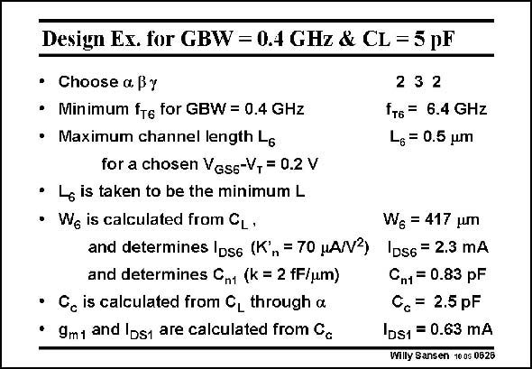

# SANSEN-0626 · Design Es. for GBW = 0.4 GHz & CL = 5 pF

章节：06 运算放大器的系统化设计  
PDF 页：190；书本页：194；幻灯片编号：0626  
状态：unreviewed



## 对应教材讲解

### PDF 190 · 书本 194

A numerical example is worked out in this slide. The very first design choices to be made are for the three design parameters. The minimum f value is T a direct result from these choices. We now have to discover which channel length can deliver such high f T values. Note that this is the actual channel length used, which may be 2–3 times higher than the minimum channel length of a particular CMOS technology. Here they are taken the same, because we do not have a lot of room left: 80 GHz f is quite high indeed. T The transistor width is a direct result of the load capacitance. It determines both the current and the value of C . n1 The compensation capacitance C is a fraction a of C . c L1 Clearly, C comes out to be 1/3 of C since b was 3. n1 c From the GBW we finally obtain g and I . m1 DS1 The total current consumption is 3.56 mA, which is quite high because of the large GBW and load capacitance. Its FOM however, is 561 MHzpF/mA, which is not bad at all!

## 公式／性能结论候选摘录

以下为规则截取的原文，尚未逐项判读。

（未由规则找到；不代表原页没有此类内容。）

## 曲线结论候选摘录

以下为规则截取的原文，尚未逐项判读。

（未由规则找到；不代表原页没有此类内容。）

## 原文条件与近似候选摘录

以下为规则截取的原文，尚未逐项判读。

（未由规则找到；不代表原页没有此类内容。）

## 幻灯片 OCR（未校正）

```text
Design Es. for GBW = 0.4 GHz & CL = 5 pF
• Choose a By
• Minimum f6 for GBW = 0.4 GHz
• Maximum channel length L6
for a chosen VGss-V,= 0.2 V
• L is taken to be the minimum L
• We is calculated from CL•
and determines Ips6 (K',= 70 MA/V2)
and determines C,1 (k = 2 fF/um)
• C is calculated from C, through a
• 9mt and Ids1 are calculated from Cc
2 3 2
fт6 = 6.4 GHz
L6 = 0.5 um
Wg = 417 um
'D56 = 2.3 mA
Cn1 = 0.83 pF
Cc = 2.5pF
|DS1 = 0.63 mA
Willy Sansen 10 05 0626
```

数学上下标、分数及正负号以原图为准。电路图已保留；未核对的连接不输出成可仿真 netlist。
