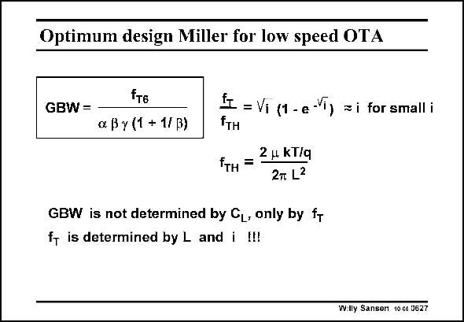

# SANSEN-0627 · Optimum design Miller for low speed OTA

章节：06 运算放大器的系统化设计  
PDF 页：191；书本页：195；幻灯片编号：0627  
状态：unreviewed



## 对应教材讲解

### PDF 191 · 书本 195

The expression of parameter f for both the weak inver- T sion and strong inversion regions is taken from Chapter 1. Clearly, it depends on inversion coefficient i and L. The expression of the GBW with only f as a T parameter, is the same as previously mentioned. For the values chosen before, we find that the maximum GBW is about 1/16 of the f of the output device. T A two-stage Miller CMOS OTA can have a small GBW, provided we select proper values of L and i. The actual power consumption will depend on the capacitive load. The larger the load, the higher the power consumption! The optimum design plan has become fairly simple now, as shown next.

## 公式／性能结论候选摘录

以下为规则截取的原文，尚未逐项判读。

- PDF 191: Clearly, it depends on inversion coefficient i and L.
- PDF 191: The actual power consumption will depend on the capacitive load.

## 曲线结论候选摘录

以下为规则截取的原文，尚未逐项判读。

（未由规则找到；不代表原页没有此类内容。）

## 原文条件与近似候选摘录

以下为规则截取的原文，尚未逐项判读。

- PDF 191: T A two-stage Miller CMOS OTA can have a small GBW, provided we select proper values of L and i.

## 幻灯片 OCR（未校正）

```text
Optimum design Miller for low speed OTA
fTE
GBW = -
a By (1 + 1/ B)
{I = Vi (1 - e-T) = i for small i
2 н kT/q
fтн =
2T L2
GBW is not determined by CL, only by fT
fy is determined by L and i I!!
Wlly Sanser 10c6 0627
```

数学上下标、分数及正负号以原图为准。电路图已保留；未核对的连接不输出成可仿真 netlist。
