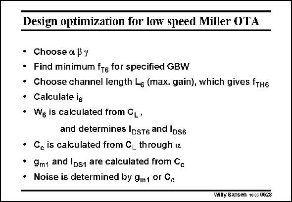

# SANSEN-0628 · Design optimization for low speed Miller OTA

章节：06 运算放大器的系统化设计  
PDF 页：191；书本页：195；幻灯片编号：0628  
状态：unreviewed



## 对应教材讲解

### PDF 191 · 书本 195

The three design choices have to be selected first. We choose the actual channel length L . It can be 6 the minimum channel length or a somewhat larger value, depending on the gain required. However, this value of L sets the fre- 6 quency f . TH6 The value of i is now easily calculated as f /f . TH TH6 The capacitive load now determines the output transistor width, and its current. All other values are now easily derived.

## 公式／性能结论候选摘录

以下为规则截取的原文，尚未逐项判读。

- PDF 191: It can be 6 the minimum channel length or a somewhat larger value, depending on the gain required.

## 曲线结论候选摘录

以下为规则截取的原文，尚未逐项判读。

（未由规则找到；不代表原页没有此类内容。）

## 原文条件与近似候选摘录

以下为规则截取的原文，尚未逐项判读。

（未由规则找到；不代表原页没有此类内容。）

## 幻灯片 OCR（未校正）

```text
Design optimization for low speed Miller OTA
• Choose a By
• Find minimum fe for specified GBW
• Choose channel length L6 (max. gain), which gives fтн6
• Calculate ig
• We is calculated from CL •
and determines IDsT6 and |D56
• C, is calculated from CL through ix
• 9m1 and Ips1 are calculated from Cc
• Noise is determined by 9m1 or Cc
Willy Sansen 1005 0628
```

数学上下标、分数及正负号以原图为准。电路图已保留；未核对的连接不输出成可仿真 netlist。
