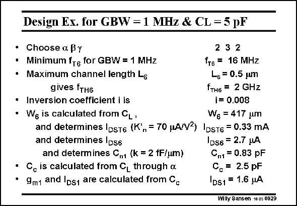

# SANSEN-0629 · Design Es. for GBW = 1 MHz & CL = 5 pF

章节：06 运算放大器的系统化设计  
PDF 页：192；书本页：196；幻灯片编号：0629  
状态：unreviewed



## 对应教材讲解

### PDF 191 · 书本 195

A numerical example is worked out below. The values speak for themselves.

### PDF 192 · 书本 196

However, the value of L 6 could have been taken larger than 0.5 mm. This would have decreased the value of f and increased TH6 the inversion coefficient i . 6 For example, doubling the channel length to 1 mm, decreases f to 480 MHz, TH6 and increases i to 0.033. This halves I to 0.16 mA. DST6 Current I doubles to DS6 5.5 mA, leaving the input stage current I un- DS1 changed at 1.6 mA. Also, the compensation capacitance is the same at 2.5 pF. The FOM of this last opamp is 575 MHzpF/mA, which is quite impressive indeed.

## 公式／性能结论候选摘录

以下为规则截取的原文，尚未逐项判读。

- PDF 192: This would have decreased the value of f and increased TH6 the inversion coefficient i . 6 For example, doubling the channel length to 1 mm, decreases f to 480 MHz, TH6 and increases i to 0.033.

## 曲线结论候选摘录

以下为规则截取的原文，尚未逐项判读。

（未由规则找到；不代表原页没有此类内容。）

## 原文条件与近似候选摘录

以下为规则截取的原文，尚未逐项判读。

（未由规则找到；不代表原页没有此类内容。）

## 幻灯片 OCR（未校正）

```text
Design Es. for GBW = 1 MHz & CL = 5 pF
• Choose a By
232
• Minimum fT6 for GBW = 1 MHz
fт6 = 16 MHZ
• Maximum channel length Ls
L.= 0.5 um
gives fTH6
fTH6 = 2 GHz
• Inversion coefficient i is
i= 0.008
• We is calculated from CL,
Wg = 417 um
and determines IDst6 (K',= 70 pA/V2) |DST6 = 0.33 mA
and determines Ds6
|DS6 = 2.7 MA
and determines Cn1 (k = 2 fF/um)
Cn1 = 0.83 pF
• C, is calculated from C, through &
C. = 2.5 pF
• 9m1 and lds1 are calculated from Cc
DS1 = 1.6 HA
Willy Sansen 10 05 0629
```

数学上下标、分数及正负号以原图为准。电路图已保留；未核对的连接不输出成可仿真 netlist。
