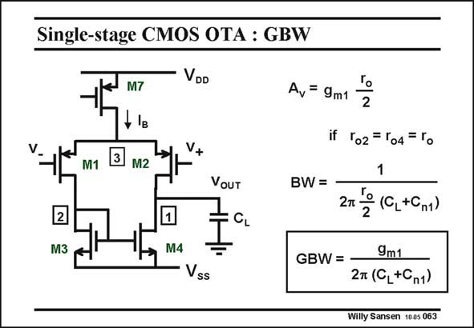

# SANSEN-063 · Single-stage CMOS OTA : GBW

章节：06 运算放大器的系统化设计  
PDF 页：178；书本页：182；幻灯片编号：063  
状态：unreviewed



## 对应教材讲解

### PDF 177 · 书本 181

A differential voltage amplifier is given in this slide. The expressions describing the gain, bandwidth and GBW of a single-stage OTA, have been previously discussed.

### PDF 178 · 书本 182

The GBW is obviously what could have been expected. Note that the load capacitance also contains some parasitic capacitances, which are due to the transistor capacitances. They are summarized as C , the sum n1 of the transistor capacitances at node 1. Nevertheless, this circuit also contains a second node, and even a third one. Do we have to take the capacitances of these nodes to ground into account? Indeed, a capacitance to ground gives a pole. Do we therefore have two additional non-dominant poles? The answer is negative. First of all, at node three, no AC signal is present when the stage is driven differentially. Node 3 does not come in. At node 2 we do have a non-dominant pole. There are two reasons however, why it can be neglected.

## 公式／性能结论候选摘录

以下为规则截取的原文，尚未逐项判读。

- PDF 177: The expressions describing the gain, bandwidth and GBW of a single-stage OTA, have been previously discussed.
- PDF 178: Do we therefore have two additional non-dominant poles?

## 曲线结论候选摘录

以下为规则截取的原文，尚未逐项判读。

（未由规则找到；不代表原页没有此类内容。）

## 原文条件与近似候选摘录

以下为规则截取的原文，尚未逐项判读。

- PDF 178: There are two reasons however, why it can be neglected.

## 幻灯片 OCR（未校正）

```text
Single-stage CMOS OTA : GBW
VDD
M1
M7
+ IB
M2
VouT
2
M3
M4
Vss
Ar =9m1 2
if ro2 = r04= ro
1
BW =
2T º (C,+Cm1)
GBW = -
9m1
2T (C,+Cп1)
Willy Sansen 1005 063
```

数学上下标、分数及正负号以原图为准。电路图已保留；未核对的连接不输出成可仿真 netlist。
