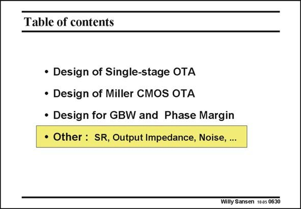

# SANSEN-0630 · Table of contents

章节：06 运算放大器的系统化设计  
PDF 页：192；书本页：196；幻灯片编号：0630  
状态：unreviewed



## 对应教材讲解

### PDF 192 · 书本 196

Up till now, the GBW and stability conditions have been studied in great detail. However, an OTA has many more specifications. Actually, the shortlist of the specifications, for which we have to carry out a design, is one of the major design decisions. The other specifications, which are not shortlisted, are to be verified later, hoping that none of them have to be upgraded to that shortlist, so that we do not have to start all over again. First of all, we will try to make a systematic list of all possible specifications. We are not sure that this is possible. For an analog circuit, some more specifications can always be added. There is always something extra that can be achieved with an analog circuit. Nevertheless, this list of specifications is fairly complete. Of course none of them will be used. It is just an attempt to list them all. Specifications of commercial amplifiers do not follow this list. They are actually a summary of measurement results. Some of them are missing. Some of them are contradictory. Afterwards, a few of the most important specifications are analyzed in detail.

## 公式／性能结论候选摘录

以下为规则截取的原文，尚未逐项判读。

（未由规则找到；不代表原页没有此类内容。）

## 曲线结论候选摘录

以下为规则截取的原文，尚未逐项判读。

（未由规则找到；不代表原页没有此类内容。）

## 原文条件与近似候选摘录

以下为规则截取的原文，尚未逐项判读。

（未由规则找到；不代表原页没有此类内容。）

## 幻灯片 OCR（未校正）

```text
Table of contents
• Design of Single-stage OTA
• Design of Miller CMOS OTA
• Design for GBW and Phase Margin
• Other : SR, Output Impedance, Noise, ...
Willy Sansen 1005 0630
```

数学上下标、分数及正负号以原图为准。电路图已保留；未核对的连接不输出成可仿真 netlist。
