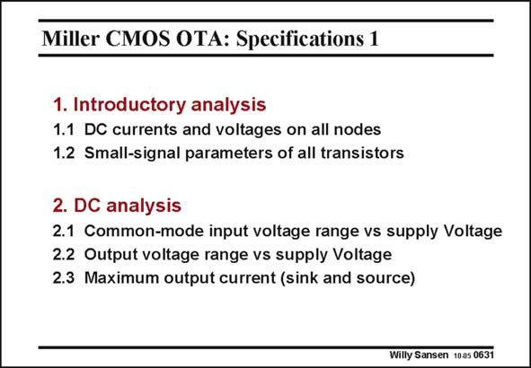

# SANSEN-0631 · Miller CMOS OTA: Specifications 1

章节：06 运算放大器的系统化设计  
PDF 页：193；书本页：197；幻灯片编号：0631  
状态：unreviewed



## 对应教材讲解

### PDF 193 · 书本 197

As an introduction, it is good to carry out a DC analysis of an amplifier somewhere in the middle of the design space. This will not give accurate data, but is a good starting point to have some idea about possible DC currents and voltages. This is followed by a small-signal analysis, so that some elementary knowledge is obtained about orders of magnitude of transconductances, output resistances, capacitances, etc. Experienced designers can leave out these two introductory steps. DC analysis comes next. Perhaps one of the most important specifications is the common-mode input range over which an amplifier can operate. This is actually the average input voltage range. For smaller and smaller supply voltages, this specification has become one of the most important. The maximum output voltage range is a lot easier to achieve. A rail-to-rail output range is quite feasible provided the output loads are purely resistive and provided only two transistors are used in the output stage with no cascodes. The maximum output current is normally the DC current of the output stage. In Chapter 11 we will add class-AB output stages to be able to deliver more current.

## 公式／性能结论候选摘录

以下为规则截取的原文，尚未逐项判读。

（未由规则找到；不代表原页没有此类内容。）

## 曲线结论候选摘录

以下为规则截取的原文，尚未逐项判读。

（未由规则找到；不代表原页没有此类内容。）

## 原文条件与近似候选摘录

以下为规则截取的原文，尚未逐项判读。

- PDF 193: A rail-to-rail output range is quite feasible provided the output loads are purely resistive and provided only two transistors are used in the output stage with no cascodes.

## 幻灯片 OCR（未校正）

```text
Miller CMOS OTA: Specifications 1
1. Introductory analysis
1.1 DC currents and voltages on all nodes
1.2 Small-signal parameters of all transistors
2. DC analysis
2.1 Common-mode input voltage range vs supply Voltage
2.2 Output voltage range vs supply Voltage
2.3 Maximum output current (sink and source)
Willy Sansen 1005 0631
```

数学上下标、分数及正负号以原图为准。电路图已保留；未核对的连接不输出成可仿真 netlist。
