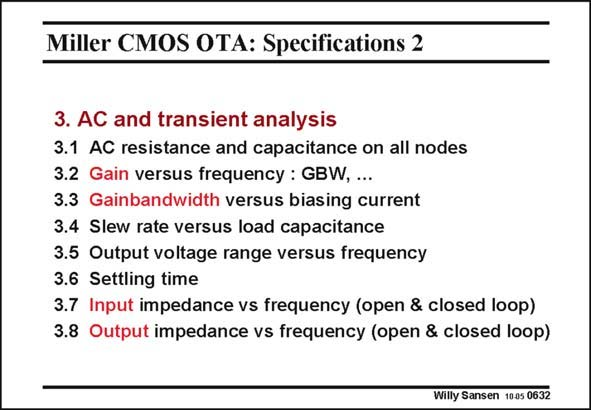

# SANSEN-0632 · Miller CMOS OTA: Specifications 2

章节：06 运算放大器的系统化设计  
PDF 页：193；书本页：197；幻灯片编号：0632  
状态：unreviewed



## 对应教材讲解

### PDF 193 · 书本 197

The AC analysis has been partially carried out. It is good practice to verify the impedance on all the nodes. It gives an idea on where to expect additional poles, etc. The gain versus frequency is actually the only specification that we have fully studied. The GBW versus biasing is a misleading specification. When we have minimized the current consumption for a certain GBW, we can then no longer modify it. Changing the current would render that amplifier unstable or generated

### PDF 194 · 书本 198

overconsumption in current. As a result, spec 3.3 does not actually exist. For an overdesigned amplifier it is possible though, to tune the GBW by means of the biasing current. The Slew Rate and output voltage at high frequencies will be discussed in more detail. They are just too important. The settling time is really important for Analog-to-digital converters and all switching applications. It will be discussed at a later stage. The input impedance of a CMOS OTA is purely capacitive as the two input C capacitances GS appear in series. For a bipolar OTA, resistances have to be added. No more attention will be paid to them. The output impedance will be examined, as there is no class-AB output stage.

## 公式／性能结论候选摘录

以下为规则截取的原文，尚未逐项判读。

- PDF 193: The gain versus frequency is actually the only specification that we have fully studied.
- PDF 194: As a result, spec 3.3 does not actually exist.

## 曲线结论候选摘录

以下为规则截取的原文，尚未逐项判读。

（未由规则找到；不代表原页没有此类内容。）

## 原文条件与近似候选摘录

以下为规则截取的原文，尚未逐项判读。

（未由规则找到；不代表原页没有此类内容。）

## 幻灯片 OCR（未校正）

```text
Miller CMOS OTA: Specifications 2
3. AC and transient analysis
3.1 AC resistance and capacitance on all nodes
3.2 Gain versus frequency : GBW, ...
3.3 Gainbandwidth versus biasing current
3.4 Slew rate versus load capacitance
3.5 Output voltage range versus frequency
3.6 Settling time
3.7 Input impedance vs frequency (open & closed loop)
3.8 Output impedance vs frequency (open & closed loop)
Willy Sansen 10.05 0632
```

数学上下标、分数及正负号以原图为准。电路图已保留；未核对的连接不输出成可仿真 netlist。
