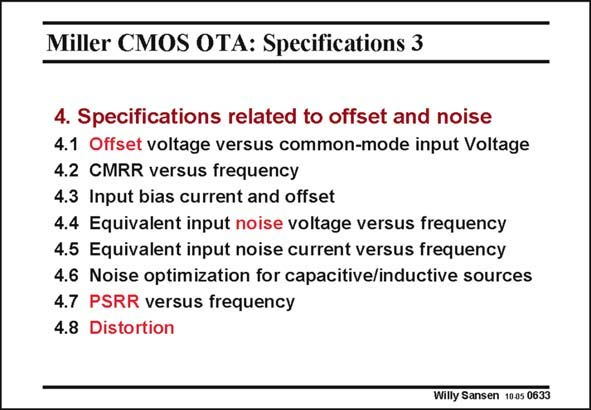

# SANSEN-0633 · Miller CMOS OTA: Specifications 3

章节：06 运算放大器的系统化设计  
PDF 页：194；书本页：198；幻灯片编号：0633  
状态：unreviewed



## 对应教材讲解

### PDF 194 · 书本 198

Many specifications are dealing with offset and noise. Offset has to do with mismatch between transistors, capacitors, etc. It can be reduced by increasing the size. The CMRR is related to it. In a sense we have two specifications, originating from the same phenomena. Actually, the PSRR is also related to it. They are all discussed in Chapter 15. The input bias current is certainly of importance for a bipolar opamps and maybe in the future for CMOS opamps, if Gate current is present. The equivalent input noise voltage and current will be discussed in detail. Capacitive noise matching has been briefly mentioned in Chapter 4. Inductive source impedances are too cumbersome and are left out here. Finally, distortion is gaining in importance. This is why a whole Chapter is devoted to it (Chapter 18).

## 公式／性能结论候选摘录

以下为规则截取的原文，尚未逐项判读。

（未由规则找到；不代表原页没有此类内容。）

## 曲线结论候选摘录

以下为规则截取的原文，尚未逐项判读。

（未由规则找到；不代表原页没有此类内容。）

## 原文条件与近似候选摘录

以下为规则截取的原文，尚未逐项判读。

（未由规则找到；不代表原页没有此类内容。）

## 幻灯片 OCR（未校正）

```text
Miller CMOS OTA: Specifications 3
4. Specifications related to offset and noise
4.1 Offset voltage versus common-mode input Voltage
4.2 CMRR versus frequency
4.3 Input bias current and offset
4.4 Equivalent input noise voltage versus frequency
4.5 Equivalent input noise current versus frequency
4.6 Noise optimization for capacitive/inductive sources
4.7 PSRR versus frequency
4.8
Distortion
Willy Sansen 10.05 0633
```

数学上下标、分数及正负号以原图为准。电路图已保留；未核对的连接不输出成可仿真 netlist。
