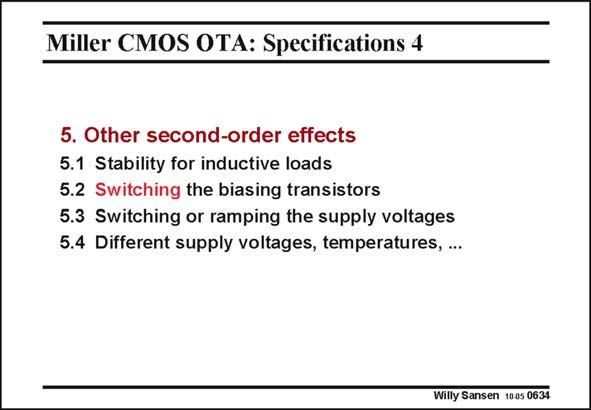

# SANSEN-0634 · Miller CMOS OTA: Specifications 4

章节：06 运算放大器的系统化设计  
PDF 页：195；书本页：199；幻灯片编号：0634  
状态：unreviewed



## 对应教材讲解

### PDF 194 · 书本 198

Finally, we have a number of more exotic aspects of opamps. Connection of an inductor instead of a capacitance as a load may impair the stability. A good example is a loudspeaker. Switching a whole opamp in and out is even more exotic. And yet, this is a technique to realize switched-capacitor filters down to really low supply voltages. Indeed, for these voltages it is no longer possible to implement switches. Switching the opamp itself is a possible solution.

### PDF 195 · 书本 199

This can be done either by switching in and out the biasing transistors or by switching the supply voltage itself. The stability and recovery are different in both cases. This will be discussed in Chapter 21. Repeating all specifications at different supply voltages and at different temperatures are obvious specifications to be added, depending on the application.

## 公式／性能结论候选摘录

以下为规则截取的原文，尚未逐项判读。

- PDF 195: Repeating all specifications at different supply voltages and at different temperatures are obvious specifications to be added, depending on the application.

## 曲线结论候选摘录

以下为规则截取的原文，尚未逐项判读。

（未由规则找到；不代表原页没有此类内容。）

## 原文条件与近似候选摘录

以下为规则截取的原文，尚未逐项判读。

（未由规则找到；不代表原页没有此类内容。）

## 幻灯片 OCR（未校正）

```text
Miller CMOS OTA: Specifications 4
5. Other second-order effects
5.1 Stability for inductive loads
5.2 Switching the biasing transistors
5.3 Switching or ramping the supply voltages
5.4 Different supply voltages, temperatures, ...
Willy Sansen 1005 0634
```

数学上下标、分数及正负号以原图为准。电路图已保留；未核对的连接不输出成可仿真 netlist。
