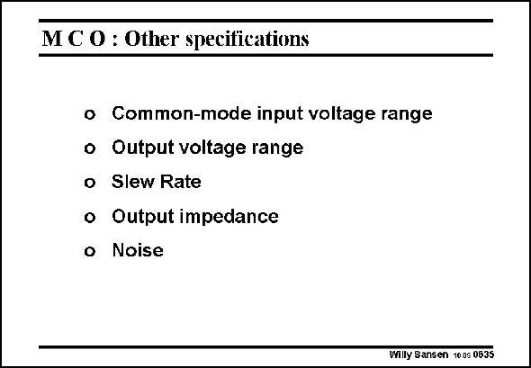

# SANSEN-0635 · MC O : Other specifications

章节：06 运算放大器的系统化设计  
PDF 页：195；书本页：199；幻灯片编号：0635  
状态：unreviewed



## 对应教材讲解

### PDF 195 · 书本 199

A few of these specifications will now be discussed. The numerical results will be given for the same Miller CMOS OTA. We start with the common-mode input voltage range.

## 公式／性能结论候选摘录

以下为规则截取的原文，尚未逐项判读。

（未由规则找到；不代表原页没有此类内容。）

## 曲线结论候选摘录

以下为规则截取的原文，尚未逐项判读。

（未由规则找到；不代表原页没有此类内容。）

## 原文条件与近似候选摘录

以下为规则截取的原文，尚未逐项判读。

（未由规则找到；不代表原页没有此类内容。）

## 幻灯片 OCR（未校正）

```text
MC O : Other specifications
o Common-mode input voltage range
o Output voltage range
o Slew Rate
o Output impedance
Noise
Willy Sansen 100s 0635
```

数学上下标、分数及正负号以原图为准。电路图已保留；未核对的连接不输出成可仿真 netlist。
