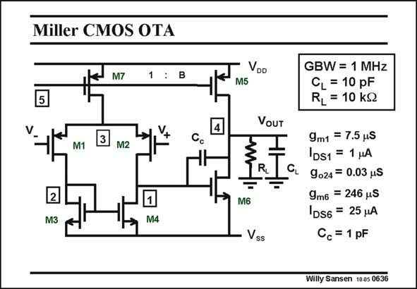

# SANSEN-0636 · Miller CMOS OTA

章节：06 运算放大器的系统化设计  
PDF 页：196；书本页：200；幻灯片编号：0636  
状态：unreviewed



## 对应教材讲解

### PDF 196 · 书本 200

For all specifications, the same amplifier will be used throughout. It is the Miller CMOS OTA of 1 MHz GBW for a 10 pF load. In this way, the reader can give himself a fairly good picture on how all these numerical specifications fit together. The circuit is shown again in this slide.

## 公式／性能结论候选摘录

以下为规则截取的原文，尚未逐项判读。

（未由规则找到；不代表原页没有此类内容。）

## 曲线结论候选摘录

以下为规则截取的原文，尚未逐项判读。

（未由规则找到；不代表原页没有此类内容。）

## 原文条件与近似候选摘录

以下为规则截取的原文，尚未逐项判读。

（未由规则找到；不代表原页没有此类内容。）

## 幻灯片 OCR（未校正）

```text
Miller CMOS OTA
M7
1 : B
5
M1
M2
2
M3
M4
VDD
M5
VOUT
M6
Vss
GBW = 1 MHz
CL = 10 pF
RL = 10 kg
9m1 = 7.5 ps
DS1 = 1 HA
9024 = 0.03 uS
9m6 = 246 uS
1DS6 = 25 HA
Cc = 1 pF
Willy Sansen 1005 0636
```

数学上下标、分数及正负号以原图为准。电路图已保留；未核对的连接不输出成可仿真 netlist。
