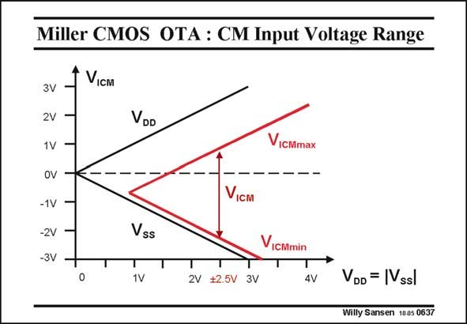

# SANSEN-0637 · Miller CMOS OTA : CM Input Voltage Range

章节：06 运算放大器的系统化设计  
PDF 页：196；书本页：200；幻灯片编号：0637  
状态：unreviewed



## 对应教材讲解

### PDF 196 · 书本 200

The Common-mode input voltage is the average input voltage. Its range is limited by the supply voltages. For the CM input voltage going up, the V of the GS1 input devices, added to the V of the DC current DS7 source, do not allow operation up to the positive supply voltage. The maximum CM input voltage is therefore V −V −V . DD GS1 DS7 The values obviously depend on which V −V GS T values have been used. For the input devices the V −V value is small (0.2 V) but it is a lot larger (0.5 V) for the DC GS T current source. For a supply voltage of ±2.5 V, the maximum CM input voltage is illustrated in this slide. The lowest possible CM input voltage can come much closer to the negative supply voltage. Indeed, it is given by V +V +V −V . This value can be quite close to the V supply SS GS3 DS1 GS1 SS but can never actually reach it, whatever V −V values are chosen. GS T The total CM input voltage range is only a fraction of the rail-to-rail span. Some other amplifiers (in Chapter 11) will be capable of input rail-to-rail performance. Also, note that this amplifier could still operate at ±1 V provided the input transistors are biased at about −0.7 V.

## 公式／性能结论候选摘录

以下为规则截取的原文，尚未逐项判读。

- PDF 196: Its range is limited by the supply voltages.
- PDF 196: The maximum CM input voltage is therefore V −V −V .
- PDF 196: DD GS1 DS7 The values obviously depend on which V −V GS T values have been used.

## 曲线结论候选摘录

以下为规则截取的原文，尚未逐项判读。

（未由规则找到；不代表原页没有此类内容。）

## 原文条件与近似候选摘录

以下为规则截取的原文，尚未逐项判读。

- PDF 196: Also, note that this amplifier could still operate at ±1 V provided the input transistors are biased at about −0.7 V.

## 幻灯片 OCR（未校正）

```text
Miller CMOS OTA : CM Input Voltage Range
VIс™
3V
2V
1V
oV
-1V
-2V
-3V
VDD
VicMmax
- -
Viс™
Vss
T
ViCMmin
T
1V
T
2V +2.5V 3V
T
4V
VDD = |Vssl
Willy Sansen 1005 0637
```

数学上下标、分数及正负号以原图为准。电路图已保留；未核对的连接不输出成可仿真 netlist。
