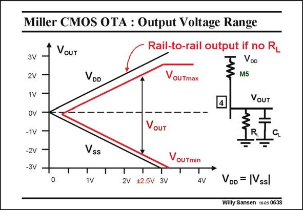

# SANSEN-0638 · Miller CMOS OTA : Output Voltage Range

章节：06 运算放大器的系统化设计  
PDF 页：197；书本页：201；幻灯片编号：0638  
状态：unreviewed



## 对应教材讲解

### PDF 197 · 书本 201

The output voltage range is a lot better! It depends on whether a resistive load is added to the capacitive one or not. Normally, there is no resistive load on-chip. Blocks are put in series such that they only see Gates as loads. This depends on the application however. If no resistive loads are present, then the output can go rail-to-rail. Indeed, even for output voltages close to the positive rail, when the output transistor ends up in the linear region, the capacitor is still charged further until the output voltage reaches the positive supply voltage. Of course, in this region, the gain will have decreased. Some distortion will now show up. Nevertheless, the supply rail can be reached! The same applies to the negative rail. If there is a resistive load, a resistive divider is created as soon as the output transistor M5 enters the linear region, as illustrated in this slide. In this case, the supply rail can never be reached. The output can get close though, depending on the size of the output transistor. Note that this is the ideal output structure for a wide-swing opamp. No cascodes are used. Moreover, the output devices are connected drain-to-drain. This is why class AB output drivers use this output configuration. Only the Gate drive circuits differ (see Chapter 12).

## 公式／性能结论候选摘录

以下为规则截取的原文，尚未逐项判读。

- PDF 197: It depends on whether a resistive load is added to the capacitive one or not.
- PDF 197: This depends on the application however.
- PDF 197: Of course, in this region, the gain will have decreased.
- PDF 197: The output can get close though, depending on the size of the output transistor.

## 曲线结论候选摘录

以下为规则截取的原文，尚未逐项判读。

（未由规则找到；不代表原页没有此类内容。）

## 原文条件与近似候选摘录

以下为规则截取的原文，尚未逐项判读。

（未由规则找到；不代表原页没有此类内容。）

## 幻灯片 OCR（未校正）

```text
Miller CMOS OTA : Output Voltage Range
VouT
Rail-to-rail output if no R_
VDD
VouTmax
M5
3V
2V
1V
OVI
-1V
-2V
-3V
VOUT
VOUT
Vss
Vou Tmin
1V
2V
+2.5V 3V
4V
VDD = |Vssl
Willy Sansen 10-05 0638
```

数学上下标、分数及正负号以原图为准。电路图已保留；未核对的连接不输出成可仿真 netlist。
