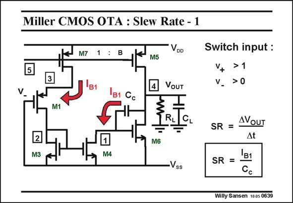

# SANSEN-0639 · Miller CMOS OTA : Slew Rate - 1

章节：06 运算放大器的系统化设计  
PDF 页：197；书本页：201；幻灯片编号：0639  
状态：unreviewed



## 对应教材讲解

### PDF 197 · 书本 201

Whenever an opamp is driven with a large input voltage, slewing occurs at the output. Large input voltages are used to try to make the opamp go faster. In this case, the input transistors are overdriven, i.e. one is on and the other is off, as illustrated in this slide. The input transistor which is on, now operates as a cascode, driven by the total input stage current I . B1 The current mirror then draws the same current from the compensation capacitance C . c

### PDF 198 · 书本 202

We have a situation where a capacitance C is driven by a constant current. As a result, the c voltage slope across it, is constant and called the Slew Rate SR. This SR appears at the output as the V is still about constant. Indeed, transistor M6 still GS6 conducts as if nothing has happened! This SR limits the steepest possible slope at the output of the opamp. Clearly, this phenomenon works in both directions.

## 公式／性能结论候选摘录

以下为规则截取的原文，尚未逐项判读。

- PDF 198: As a result, the c voltage slope across it, is constant and called the Slew Rate SR.
- PDF 198: This SR limits the steepest possible slope at the output of the opamp.

## 曲线结论候选摘录

以下为规则截取的原文，尚未逐项判读。

- PDF 198: As a result, the c voltage slope across it, is constant and called the Slew Rate SR.
- PDF 198: This SR limits the steepest possible slope at the output of the opamp.

## 原文条件与近似候选摘录

以下为规则截取的原文，尚未逐项判读。

（未由规则找到；不代表原页没有此类内容。）

## 幻灯片 OCR（未校正）

```text
Miller CMOS OTA : Slew Rate - 1
M7
VDo
'в1
M5
4
VOUT
Switch input :
+
>1
v. >0
1B1 Cc
M1
RL
2
M3
M6
M4
•Vss
SR = AVouT
At
'B1
SR =
Willy Sansen 1005 0639
```

数学上下标、分数及正负号以原图为准。电路图已保留；未核对的连接不输出成可仿真 netlist。
