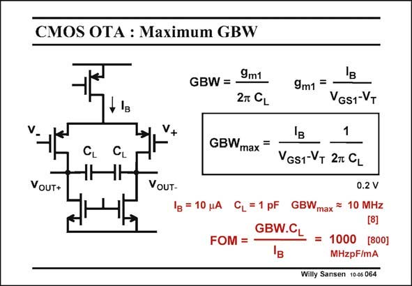

# SANSEN-064 · CMOS OTA : Maximum GBW

章节：06 运算放大器的系统化设计  
PDF 页：178；书本页：182；幻灯片编号：064  
状态：unreviewed



## 对应教材讲解

### PDF 178 · 书本 182

Before we focus on the nondominant poles, let us find out how much GBW can be expected from such a simple amplifier. We know already that it is the best for lowpower consumption. What does this mean in actual numbers? The simplest Figure of Merit (FOM) for opamps is the one with the GBW, the C and the power consump- L tion. Later on, some other specifications could be added, such as noise, or swing, etc. Instead of the power consumption, the current consumption can also be taken. For this purpose, a differential configuration has been taken as sketched in this slide. The effective load capacitance is now only half of what we would have for a single-ended output. On the other hand, there is also no current mirror to double the output current. This OTA is representative for a single-stage amplifier! We find that for a 10 mA total current, a load capacitance of 1 pF can still yield a GBW of

### PDF 179 · 书本 183

10 MHz. Even easier to remember is that with 1 mA, a 1 MHz GBW can be achieved for a 1pF load capacitance. This gives a FOM of 1000 in MHzpF/mA. Actually, it is slightly less, i.e. 800. We will see however, that this is an excellent result, when we compare with other OTA’s in the next Chapter.

## 公式／性能结论候选摘录

以下为规则截取的原文，尚未逐项判读。

（未由规则找到；不代表原页没有此类内容。）

## 曲线结论候选摘录

以下为规则截取的原文，尚未逐项判读。

（未由规则找到；不代表原页没有此类内容。）

## 原文条件与近似候选摘录

以下为规则截取的原文，尚未逐项判读。

（未由规则找到；不代表原页没有此类内容。）

## 幻灯片 OCR（未校正）

```text
CMOS OTA : Maximum GBW
+ ІB
V+
CL
VoUT+
VoUT-
GBW = 9m1
27 CL
9m1=
VGS1-VT
1
GBWmax=
VGs1-VT 2T GL
0.2 V
1в = 10 JA CL =1 pF GBWmax =
10 MHz
[8)
GBW.CL
FOM =
=
1000 [800]
B
MHzpF/mA
Willy Sansen 10-05 064
```

数学上下标、分数及正负号以原图为准。电路图已保留；未核对的连接不输出成可仿真 netlist。
