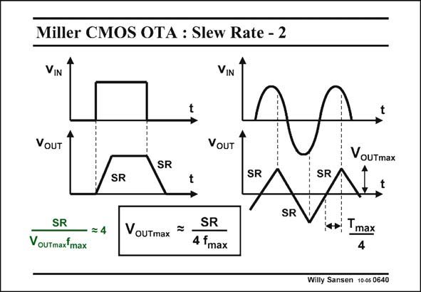

# SANSEN-0640 · Miller CMOS OTA : Slew Rate - 2

章节：06 运算放大器的系统化设计  
PDF 页：198；书本页：202；幻灯片编号：0640  
状态：unreviewed



## 对应教材讲解

### PDF 198 · 书本 202

This steepest possible slope at the output is clearly visible when the opamp is driven by a square waveform with large amplitude. A trapezoidal output waveform results, clearly showing the limited slopes. This slewing is also visible when a sinusoidal waveform is applied with large amplitude. In this case, triagonal distortion results. This latter waveform shows that there is a direct link between the maximum amplitude V , the frequency f and the Slew Rate SR. During a period T /4, the SR OUTmax max max allows a maximum amplitude V . The maximum output voltage V is therefore heavily OUTmax OUTmax limited by the Slew Rate, as given by this expression. This is plotted next.

## 公式／性能结论候选摘录

以下为规则截取的原文，尚未逐项判读。

- PDF 198: A trapezoidal output waveform results, clearly showing the limited slopes.
- PDF 198: The maximum output voltage V is therefore heavily OUTmax OUTmax limited by the Slew Rate, as given by this expression.

## 曲线结论候选摘录

以下为规则截取的原文，尚未逐项判读。

- PDF 198: This steepest possible slope at the output is clearly visible when the opamp is driven by a square waveform with large amplitude.
- PDF 198: This is plotted next.

## 原文条件与近似候选摘录

以下为规则截取的原文，尚未逐项判读。

（未由规则找到；不代表原页没有此类内容。）

## 幻灯片 OCR（未校正）

```text
Miller CMOS OTA : Slew Rate - 2
VIN
VIN
VoUT
VOUT
VouTmax
SR
SR
SR
SR
SR
SR
— = 4
VouTmaxfmax
VouTmax
SR
4 fmax
Tmax
4
Willy Sansen 10-05 0640
```

数学上下标、分数及正负号以原图为准。电路图已保留；未核对的连接不输出成可仿真 netlist。
