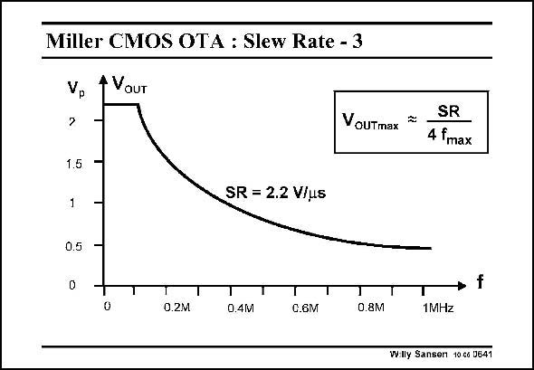

# SANSEN-0641 · Miller CMOS OTA : Slew Rate - 3

章节：06 运算放大器的系统化设计  
PDF 页：198；书本页：202；幻灯片编号：0641  
状态：unreviewed



## 对应教材讲解

### PDF 198 · 书本 202

This plot shows that for higher frequencies, close to the GBW, only small output voltage amplitudes can be expected. This curve is also called the large-signal bandwidth of the OTA. In this design example, a SR of 2.2 V/ms only provides 0.4 V at the GBW of peak 1 MHz, rather than 2.5 V peak at low frequencies. It is not clear how to remedy this, as both GBW and SR depend on the input transistor current and capacitance C . c

### PDF 199 · 书本 203

Actually, we want to achieve a larger SR for the same GBW. Which transistor parameters have to be adjusted?

## 公式／性能结论候选摘录

以下为规则截取的原文，尚未逐项判读。

- PDF 198: This curve is also called the large-signal bandwidth of the OTA.
- PDF 198: It is not clear how to remedy this, as both GBW and SR depend on the input transistor current and capacitance C . c

## 曲线结论候选摘录

以下为规则截取的原文，尚未逐项判读。

- PDF 198: This plot shows that for higher frequencies, close to the GBW, only small output voltage amplitudes can be expected.
- PDF 198: This curve is also called the large-signal bandwidth of the OTA.
- PDF 198: In this design example, a SR of 2.2 V/ms only provides 0.4 V at the GBW of peak 1 MHz, rather than 2.5 V peak at low frequencies.

## 原文条件与近似候选摘录

以下为规则截取的原文，尚未逐项判读。

（未由规则找到；不代表原页没有此类内容。）

## 幻灯片 OCR（未校正）

```text
Miller CMOS OTA : Slew Rate - 3
A VaUT
SR
VouTmax * 4 fmax
1.5
-
1
T
SR = 2.2 V/u5
0.5
0
T
T
0.2M
T
0.4lv1
T
C.6M
0.8M
• f
1MHZ
Willy Sanser 10c6 U641
```

数学上下标、分数及正负号以原图为准。电路图已保留；未核对的连接不输出成可仿真 netlist。
