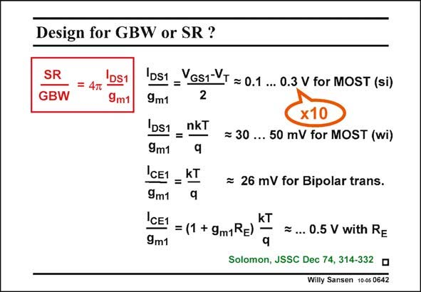

# SANSEN-0642 · Design for GBW or SR ?

章节：06 运算放大器的系统化设计  
PDF 页：199；书本页：203；幻灯片编号：0642  
状态：unreviewed



## 对应教材讲解

### PDF 199 · 书本 203

In order to achieve a larger SR for the same GBW, we take the ratio and rewrite it in terms of transistor parameters. We find that for a MOST, this ratio is simply proportional to its V −V . The GS T larger we make the input transistor V −V , the GS1 T larger the SR will be for the same GBW. Clearly, SR has to do with high speed. This result is not unexpected. We have known all along that for high speed we need to take large values of V −V . The noise performance will suffer from that, but again we have GS1 T known this all along. Clearly, the use of a bipolar transistor at the input reduces the SR by a factor of 10 for the same GBW. This also applies to a MOST in weak inversion. In order to improve the SR for a bipolar amplifier, we have to insert series resistors. The SR increases accordingly. Clearly, the noise performance suffers from that as well. To realize an amplifier with high speed or SR, and low noise at the same time is a real compromise!

## 公式／性能结论候选摘录

以下为规则截取的原文，尚未逐项判读。

- PDF 199: We find that for a MOST, this ratio is simply proportional to its V −V .
- PDF 199: The SR increases accordingly.

## 曲线结论候选摘录

以下为规则截取的原文，尚未逐项判读。

（未由规则找到；不代表原页没有此类内容。）

## 原文条件与近似候选摘录

以下为规则截取的原文，尚未逐项判读。

（未由规则找到；不代表原页没有此类内容。）

## 幻灯片 OCR（未校正）

```text
Design for GBW or SR ?
SR
GBW
DS1
= 4T
9m1
DS1
9m1
VGs1-VT = 0.1 ... O.3 V for MOST (si)
2
DS1
nkT
=
= 30
9m1
CE1 _KT
9m1
CE1
= (1 + 9m1RE)
9m1
x10
50 mV for MOST (wi)
= 26 mV for Bipolar trans.
kT
= ... 0.5 V with Re
q
Solomon, JSSC Dec 74, 314-332 •
Willy Sansen 10-05 0642
```

数学上下标、分数及正负号以原图为准。电路图已保留；未核对的连接不输出成可仿真 netlist。
