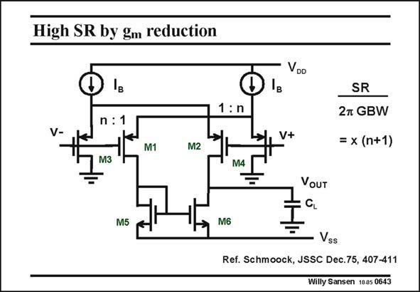

# SANSEN-0643 · High SR by gm reduction

章节：06 运算放大器的系统化设计  
PDF 页：199；书本页：203；幻灯片编号：0643  
状态：unreviewed



## 对应教材讲解

### PDF 199 · 书本 203

There is a possibility to decouple SR from GBW by using cross-coupling as shown in this slide (actually realized for bipolar transistors). However, the cost is increased power consumption. For small signals, transistors M1 and M2 provide gain and GBW as usual. They run at a fairly small DC current however, such that their g is also small. m Their DC current is only 1/(n+1) of the biasing current I . B For large input signals the input transistors switch on or off. As a result all current I can B

### PDF 200 · 书本 204

flow to the output, to slew the output voltage. The current is now n+1 times larger. The ratio SR/GBW is also n+1 times higher. The main drawback is obviously that for small signals, a large current I is flowing, only a B small fraction of which is used to generate transconductance. Most of the DC current is now actually wasted.

## 公式／性能结论候选摘录

以下为规则截取的原文，尚未逐项判读。

- PDF 199: However, the cost is increased power consumption.
- PDF 199: For small signals, transistors M1 and M2 provide gain and GBW as usual.
- PDF 199: As a result all current I can B

## 曲线结论候选摘录

以下为规则截取的原文，尚未逐项判读。

（未由规则找到；不代表原页没有此类内容。）

## 原文条件与近似候选摘录

以下为规则截取的原文，尚未逐项判读。

（未由规则找到；不代表原页没有此类内容。）

## 幻灯片 OCR（未校正）

```text
High SR by gm reduction
VDO
1 :n
V-
n :1
M3
M1
M2
V+
SR
2m GBW
= x (n+1)
M4
VOUT
CL
M5
M6
Vss
Ref. Schmoock, JSSC Dec.75, 407-411
Willy Sansen 1005 0643
```

数学上下标、分数及正负号以原图为准。电路图已保留；未核对的连接不输出成可仿真 netlist。
