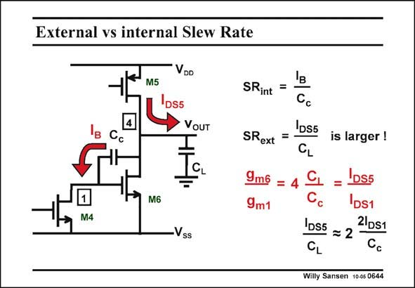

# SANSEN-0644 · External vs internal Slew Rate

章节：06 运算放大器的系统化设计  
PDF 页：200；书本页：204；幻灯片编号：0644  
状态：unreviewed



## 对应教材讲解

### PDF 200 · 书本 204

Normally, it is the internal Slew Rate which establishes the limit. However, it can also be the external Slew Rate. The load capacitance needs to be charged as well. All current of current source M5 is now used to slew the output voltage. In the design procedures presented in this Chapter, the output stage current is a lot larger than the input stage current, whereas the compensation capacitance is only a factor 2–3 times smaller than the load capacitance, the internal SR is the limiting factor, by at least a factor of 2. This is not always the case however and should be verified. In the example of the 1MHz Miller CMOS OTA, the internal SR is 2.2 V/ms but the external SR is only 2.5 V/ms, which is barely larger!

## 公式／性能结论候选摘录

以下为规则截取的原文，尚未逐项判读。

- PDF 200: Normally, it is the internal Slew Rate which establishes the limit.
- PDF 200: In the design procedures presented in this Chapter, the output stage current is a lot larger than the input stage current, whereas the compensation capacitance is only a factor 2–3 times smaller than the load capacitance, the internal SR is the limiting factor, by at least a factor of 2.

## 曲线结论候选摘录

以下为规则截取的原文，尚未逐项判读。

（未由规则找到；不代表原页没有此类内容。）

## 原文条件与近似候选摘录

以下为规则截取的原文，尚未逐项判读。

（未由规则找到；不代表原页没有此类内容。）

## 幻灯片 OCR（未校正）

```text
External vs internal Slew Rate
M5
VDD
DS5
VOUT
'в
Cc
M6
M4
'B
SRint
=
Cc
DS5
SRext
=
CL
9m6
9m1
Vss
is larger !
'DS5
C
IDS1
1D55 = 2
2 DS1
CL
Cc
Willy Sansen 10-05 0644
```

数学上下标、分数及正负号以原图为准。电路图已保留；未核对的连接不输出成可仿真 netlist。
