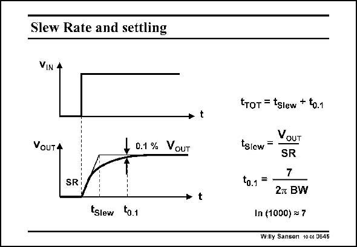

# SANSEN-0645 · Slew Rate and settling

章节：06 运算放大器的系统化设计  
PDF 页：200；书本页：204；幻灯片编号：0645  
状态：unreviewed



## 对应教材讲解

### PDF 200 · 书本 204

The Slew Rate is also part of the total settling time. When we apply a square waveform with large amplitude, the output will slew first until it reaches the final output voltage within a large percentage, let us say 10%. From then on the small-signal operation is taking over and the bandwidth (or GBW) is determining the settling time. The cross-over from SR to BW limiting behavior is not clear. The minimum settling time would be based on a calculation in which we forget about the SR altogether. In this case, 0.1% settling takes 6.9 (or 7) time constants.

### PDF 201 · 书本 205

The maximum settling time is obtained by addition of the time required to slew from zero to the final output voltage, to the 7 time constants required to reach 0.1% accuracy. For example, if we take the same 1 MHz Miller CMOS OTA, set at a closed-loop gain of 10. The BW is 100 kHz and the corresponding time constant is 1.6 ms. Settling to 0.1% would take 7 time constants or 11.2 ms. To reach an output voltage of 1 V with a SR of 2.2 V/ms takes 0.45 ms. The total settling time is now between 11.2 and 11.6 ms. The actual settling time takes up most of the time!

## 公式／性能结论候选摘录

以下为规则截取的原文，尚未逐项判读。

- PDF 200: From then on the small-signal operation is taking over and the bandwidth (or GBW) is determining the settling time.
- PDF 200: The cross-over from SR to BW limiting behavior is not clear.
- PDF 201: For example, if we take the same 1 MHz Miller CMOS OTA, set at a closed-loop gain of 10.

## 曲线结论候选摘录

以下为规则截取的原文，尚未逐项判读。

（未由规则找到；不代表原页没有此类内容。）

## 原文条件与近似候选摘录

以下为规则截取的原文，尚未逐项判读。

（未由规则找到；不代表原页没有此类内容。）

## 幻灯片 OCR（未校正）

```text
Slew Rate and settling
VIN 4
• t
VoUTA
+ D.1% VOUT
SRI
• t
tslew to.1
tтот = tslew + to.1
VoUT
tslcw=
SR
7
t0.1 = -
2a BW
In (1000) ~ 7
Wily Sansen 10c6 U645
```

数学上下标、分数及正负号以原图为准。电路图已保留；未核对的连接不输出成可仿真 netlist。
