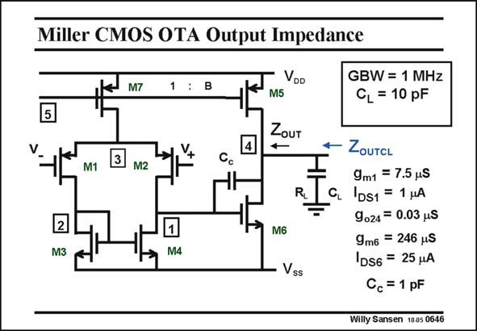

# SANSEN-0646 · Miller CMOS OTA Output Impedance

章节：06 运算放大器的系统化设计  
PDF 页：201；书本页：205；幻灯片编号：0646  
状态：unreviewed



## 对应教材讲解

### PDF 201 · 书本 205

The output impedance is examined next. For this purpose, we have left out the external resistive load. They are normally absent anyway. We can distinguish two output impedances, i.e. the one of the amplifier itself Z and the OUT output impedance including the load capacitance Z . The latter one is the OUTCL impedance at the interconnect to the next stage. The output impedance Z itself is high at low fre- OUT quencies, where it is the parallel combination of the r ’s of M5 and M6. o At high frequencies however, the compensation capacitance C acts as a short. The output c impedance Z becomes resistive with value 1/g . This is shown next. OUT m6

## 公式／性能结论候选摘录

以下为规则截取的原文，尚未逐项判读。

（未由规则找到；不代表原页没有此类内容。）

## 曲线结论候选摘录

以下为规则截取的原文，尚未逐项判读。

（未由规则找到；不代表原页没有此类内容。）

## 原文条件与近似候选摘录

以下为规则截取的原文，尚未逐项判读。

（未由规则找到；不代表原页没有此类内容。）

## 幻灯片 OCR（未校正）

```text
Miller CMOS OTA Output Impedance
5
M7
1
VDD
M5
ZouT
4
M1
M2
RL
2
M3
M6
M4
Vss
GBW = 1 MHz
CL = 10 pF
ZOUTCL
9m1 = 7.5 pS
CL DS1 = 1 uA
9024= 0.03 uS
9m6 = 246 uS
DS6 = 25 HA
Cc = 1 pF
Willy Sansen 1005 0646
```

数学上下标、分数及正负号以原图为准。电路图已保留；未核对的连接不输出成可仿真 netlist。
