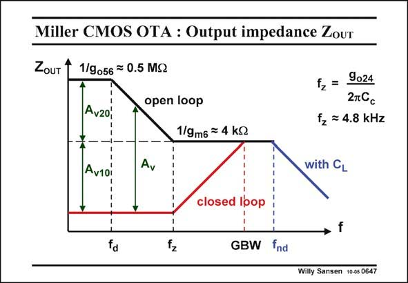

# SANSEN-0647 · Miller CMOS OTA : Output impedance Zour

章节：06 运算放大器的系统化设计  
PDF 页：201；书本页：205；幻灯片编号：0647  
状态：unreviewed



## 对应教材讲解

### PDF 201 · 书本 205

Without feedback, the openloop output impedance Z is high indeed at low OUT frequencies. It decreases until it reaches the level 1/g . m6 The pole f of this Z is d OUT about the same as for the open-loop gain characteristic. The zero f however, is z a new characteristic frequency. It is nowhere visible in the gain characteristic. It only appears in the output impedance and in the noise characteristic, which comes next.

### PDF 202 · 书本 206

Actually, this zero is at the frequency where the output resistance of the first stage is taken over by the impedance of the compensation capacitance C . It is the frequency where the gain c of the first stage starts decreasing. Anyway, for most of the frequency region, the output impedance is quite low. As a result, we do not need a class AB stage. These latter stages are only necessary to drive off-chip loads. Also, a line connection at an impedance of a few kV’s does not pick up a lot of noise. It is a good value for interconnect. Application of unity-gain feedback causes the output impedance to be divided by the total gain. Since the pole f is the same for both, it disappears. The zero remains, indicating a wide d region which is inductive. With the load capacitance C included, the impedance Z starts decreasing at the non- L OUTCL dominant pole f . nd

## 公式／性能结论候选摘录

以下为规则截取的原文，尚未逐项判读。

- PDF 201: It decreases until it reaches the level 1/g . m6 The pole f of this Z is d OUT about the same as for the open-loop gain characteristic.
- PDF 201: It is nowhere visible in the gain characteristic.
- PDF 202: It is the frequency where the gain c of the first stage starts decreasing.
- PDF 202: As a result, we do not need a class AB stage.
- PDF 202: Application of unity-gain feedback causes the output impedance to be divided by the total gain.

## 曲线结论候选摘录

以下为规则截取的原文，尚未逐项判读。

- PDF 201: It decreases until it reaches the level 1/g . m6 The pole f of this Z is d OUT about the same as for the open-loop gain characteristic.
- PDF 201: The zero f however, is z a new characteristic frequency.
- PDF 201: It is nowhere visible in the gain characteristic.
- PDF 201: It only appears in the output impedance and in the noise characteristic, which comes next.

## 原文条件与近似候选摘录

以下为规则截取的原文，尚未逐项判读。

（未由规则找到；不代表原页没有此类内容。）

## 幻灯片 OCR（未校正）

```text
Miller CMOS OTA : Output impedance Zour
ZouT
1/9056 = 0.5 MS2
open loop
Av2o,
1/9m6 = 4 kS
Av1oi
Av
12 = 9024
27G
fz = 4.8 kHz
with CL
fd
N*
closed Ibop
GBW fnd
→ f
Willy Sansen 1005 0647
```

数学上下标、分数及正负号以原图为准。电路图已保留；未核对的连接不输出成可仿真 netlist。
