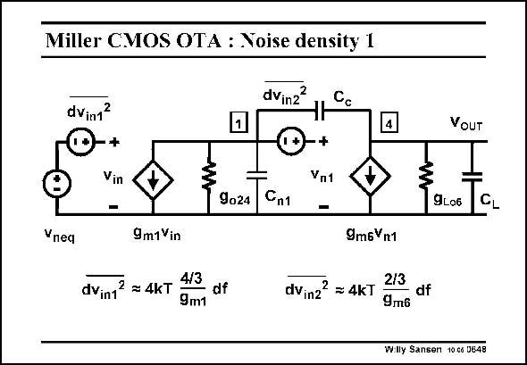

# SANSEN-0648 · Miller CMOS OTA : Noise density 1

章节：06 运算放大器的系统化设计  
PDF 页：202；书本页：206；幻灯片编号：0648  
状态：unreviewed



## 对应教材讲解

### PDF 202 · 书本 206

In order to find the equivalent input noise voltage, we have to introduce the input noise voltages for the first and second stages. They are included in the small-signal equivalent circuit shown in this slide. The input noise of the input stage is given as well. Only the two input transistors themselves are included. We have assumed that the current mirror devices have been designed for low noise. The input noise of the second stage is due to transistor M6 only. It is embedded in the circuit in this slide. Note that it has taken a fairly strange position, in series with the Gate. Therefore, its effect is not found that easily. We now have to shift the input noise voltage of the second stage to the input. For this purpose, we calculate its contribution to the output, and then divide it by the total gain. The result is shown next.

## 公式／性能结论候选摘录

以下为规则截取的原文，尚未逐项判读。

- PDF 202: Therefore, its effect is not found that easily.
- PDF 202: For this purpose, we calculate its contribution to the output, and then divide it by the total gain.

## 曲线结论候选摘录

以下为规则截取的原文，尚未逐项判读。

（未由规则找到；不代表原页没有此类内容。）

## 原文条件与近似候选摘录

以下为规则截取的原文，尚未逐项判读。

- PDF 202: We have assumed that the current mirror devices have been designed for low noise.

## 幻灯片 OCR（未校正）

```text
Miller CMOS OTA : Noise density 1
dVinz?
Cc
dvin1?
VoUT
Vin
9024
Cn1
Vn1
-
9L06
C
Vnea
9m1Vin
dVin12 = 4KT
4/3
df
9m1
dVinz2 = 4KT
9m6Vn1
2/3
df
9m6
Willy Sansen 10.c6 U6-48
```

数学上下标、分数及正负号以原图为准。电路图已保留；未核对的连接不输出成可仿真 netlist。
