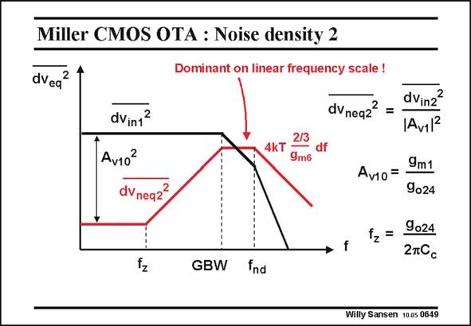

# SANSEN-0649 · Miller CMOS OTA : Noise density 2

章节：06 运算放大器的系统化设计  
PDF 页：203；书本页：207；幻灯片编号：0649  
状态：unreviewed



## 对应教材讲解

### PDF 202 · 书本 206

Both contributions of the noise sources to the output noise are shown in this slide for unitygain feedback. The contribution of the input stage drops off at frequencies beyond the GBW. The second-stage noise however, becomes dominant at high frequencies. The behavior at these frequencies is most important as noise has to be looked at on a linear frequency scale. At low frequencies the noise density of the second stage is clearly negligible. It can be divided by the gain of the first stage squared. Beyond the zero frequency f , which is the same as for the output impedance, the noise z contribution of the second stage starts rising, until it becomes dominant at the highest frequencies.

### PDF 203 · 书本 207

The noise starts rising because from the zero frequency on, the gain of the first stage goes down. As a result, the noise goes up. The result is not so bad in the sense that the noise density of the second stage never really takes over below the GBW. The maximum noise contribution of the second stage is actually the input noise voltage, as given in the previous slide. Since g is much larger m6 than g , the noise of the m1 second stage is always negligible with respect to the noise of the first stage.

## 公式／性能结论候选摘录

以下为规则截取的原文，尚未逐项判读。

- PDF 202: It can be divided by the gain of the first stage squared.
- PDF 203: The noise starts rising because from the zero frequency on, the gain of the first stage goes down.
- PDF 203: As a result, the noise goes up.

## 曲线结论候选摘录

以下为规则截取的原文，尚未逐项判读。

（未由规则找到；不代表原页没有此类内容。）

## 原文条件与近似候选摘录

以下为规则截取的原文，尚未逐项判读。

- PDF 203: Since g is much larger m6 than g , the noise of the m1 second stage is always negligible with respect to the noise of the first stage.

## 幻灯片 OCR（未校正）

```text
Miller CMOS OTA : Noise density 2
Dominant on linear frequency scale !
dVeq
2
dVint2
dVinz?
dVneq2? =
IAv11R
2/3
4kT
df
9m6
Av1o?
dv neqz?
Avio= 9m1
9024
f
9024
fz=
2TC
N*
GBW
fnd
Willy Sansen 1005 0649
```

数学上下标、分数及正负号以原图为准。电路图已保留；未核对的连接不输出成可仿真 netlist。
