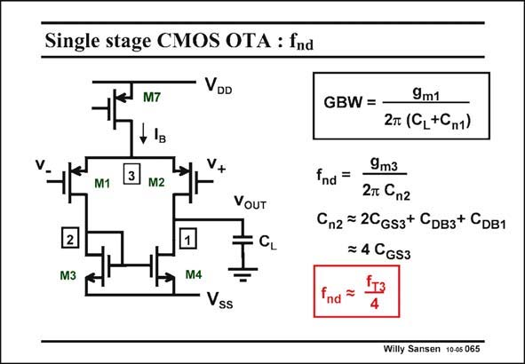

# SANSEN-065 · Single stage CMOS OTA : fnd

章节：06 运算放大器的系统化设计  
PDF 页：179；书本页：183；幻灯片编号：065  
状态：unreviewed



## 对应教材讲解

### PDF 179 · 书本 183

Let us now focus again on non-dominant poles. The position of this nondominant pole is easily established. The resistance at node 2 is simply 1/g . m3 The node capacitance C is n2 the sum of all transistor capacitances, connected to node 2. For a MOST, the capacitance C is about equal to DB its C . This is why all four GS capacitances in C are n2 taken equal. This is a gross approximation but good enough to deal with this pole. Capacitance C is about 4×CGS3. n2 The non-dominant pole f is about f /4. This is the first reason why node 2 does not affect nd T3 us too much. This non-dominant pole is simply located at too high frequencies, compared to the GBW. The second reason is on the next slide.

## 公式／性能结论候选摘录

以下为规则截取的原文，尚未逐项判读。

- PDF 179: For a MOST, the capacitance C is about equal to DB its C .
- PDF 179: This is why all four GS capacitances in C are n2 taken equal.

## 曲线结论候选摘录

以下为规则截取的原文，尚未逐项判读。

（未由规则找到；不代表原页没有此类内容。）

## 原文条件与近似候选摘录

以下为规则截取的原文，尚未逐项判读。

- PDF 179: This is a gross approximation but good enough to deal with this pole.

## 幻灯片 OCR（未校正）

```text
Single stage CMOS OTA : fnd
M7
+ Is
M1
M2
VDD
V+
VOUT
CL
GBW = -
9m1
2т (CL+Cn1)
fnd =
9m3
27 Cn2
Cn2 = 2CGs3+ CDвз+ CDB1
= 4 CGs3
M3
M4
Vss
ind
Willy Sansen 10-05 065
```

数学上下标、分数及正负号以原图为准。电路图已保留；未核对的连接不输出成可仿真 netlist。
