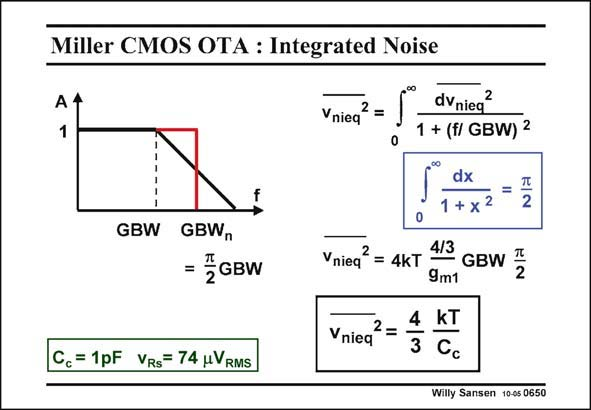

# SANSEN-0650 · Miller CMOS OTA : Integrated Noise

章节：06 运算放大器的系统化设计  
PDF 页：203；书本页：207；幻灯片编号：0650  
状态：unreviewed



## 对应教材讲解

### PDF 203 · 书本 207

In order to find the integrated noise of this OTA, we have to integrate the input noise density over all frequencies. Since we are dealing with a first-order rolloff, we will find again this increase of the bandwidth to the noise bandwidth by a factor of p/2. A unity-gain situation is used. The bandwidth equals the GBW. The total integrated noise is now simply the product of the equivalent input noise voltage with the noise bandwidth. Since transconductance g determines both, the input noise voltage and the GBW, it cancels m1 out. As a result, the total integrated noise only contains the compensation capacitance C . c The noise of the second stage has been neglected although its contribution is close to 20%. Increasing the total integrated noise performance, will require larger capacitances, and hence larger currents. Low noise always leads to higher power consumption!

## 公式／性能结论候选摘录

以下为规则截取的原文，尚未逐项判读。

- PDF 203: Since we are dealing with a first-order rolloff, we will find again this increase of the bandwidth to the noise bandwidth by a factor of p/2.
- PDF 203: A unity-gain situation is used.
- PDF 203: The bandwidth equals the GBW.
- PDF 203: The total integrated noise is now simply the product of the equivalent input noise voltage with the noise bandwidth.
- PDF 203: As a result, the total integrated noise only contains the compensation capacitance C . c The noise of the second stage has been neglected although its contribution is close to 20%.

## 曲线结论候选摘录

以下为规则截取的原文，尚未逐项判读。

（未由规则找到；不代表原页没有此类内容。）

## 原文条件与近似候选摘录

以下为规则截取的原文，尚未逐项判读。

- PDF 203: As a result, the total integrated noise only contains the compensation capacitance C . c The noise of the second stage has been neglected although its contribution is close to 20%.

## 幻灯片 OCR（未校正）

```text
Miller CMOS OTA : Integrated Noise
Vnieq
2
=
1
GBW
GBWn
≤GBW
Cc= 1pF VRs= 74 uVRMS
dVnieq
2
1 + (f/ GBW) 2
dx
1 + x2
2
Vnieq
2
4/3
= 4kT
9m1
GBW [
Vniea
2 =
4 kT
3 Cc
Willy Sansen 10-05 0650
```

数学上下标、分数及正负号以原图为准。电路图已保留；未核对的连接不输出成可仿真 netlist。
