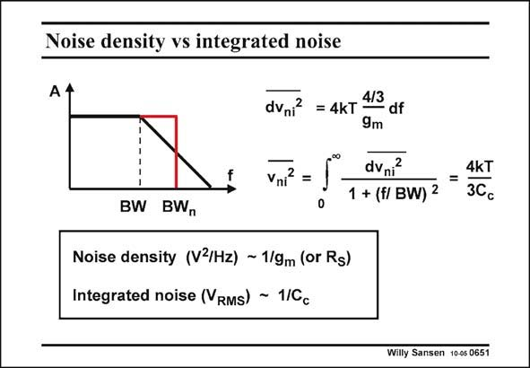

# SANSEN-0651 · Noise density vs integrated noise

章节：06 运算放大器的系统化设计  
PDF 页：204；书本页：208；幻灯片编号：0651  
状态：unreviewed



## 对应教材讲解

### PDF 204 · 书本 208

As for resistive noise, OTA noise leads to similar conclusions. Noise density always depends on resistors or transconductances, whereas integrated noise depends on the main capacitance. This is C for a single-stage L amplifier but C for a twoc or three-stage amplifier. They are linked, however. Larger capacitances will lead to larger currents, which will yield larger transconductances. Care has to be exerted however, to make sure that the noise of the output stage does not become dominant at the highest frequencies of interest. For this purpose the output g must m always be larger than the input g . This is a requirement which has originated from stability m considerations as well!

## 公式／性能结论候选摘录

以下为规则截取的原文，尚未逐项判读。

- PDF 204: Noise density always depends on resistors or transconductances, whereas integrated noise depends on the main capacitance.

## 曲线结论候选摘录

以下为规则截取的原文，尚未逐项判读。

（未由规则找到；不代表原页没有此类内容。）

## 原文条件与近似候选摘录

以下为规则截取的原文，尚未逐项判读。

（未由规则找到；不代表原页没有此类内容。）

## 幻灯片 OCR（未校正）

```text
Noise density vs integrated noise
dvni? = 4kT 4/3
- df
9m
Vni?
=
dvni?
1 + (f/ BW) 2
4kT
3Cc
BW BWn
Noise density (V3/Hz) ~ 1/gm (or Rs)
Integrated noise (RMs) - 1/Cc
Willy Sansen 10-05 0651
```

数学上下标、分数及正负号以原图为准。电路图已保留；未核对的连接不输出成可仿真 netlist。
