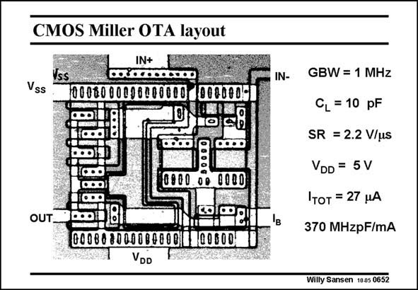

# SANSEN-0652 · CMOS Miller OTA layout

章节：06 运算放大器的系统化设计  
PDF 页：204；书本页：208；幻灯片编号：0652  
状态：unreviewed



## 对应教材讲解

### PDF 204 · 书本 208

As a conclusion on this Miller CMOS OTA of 1 MHz GBW for a 10 pF load capacitance, we need to look at the layout. The input devices at the right in the middle, are fairly big to suppress the 1/f noise somewhat. The output devices at the left. They are obviously larger. The compensation capacitance of 1 pF is clearly visible, although quite small.

## 公式／性能结论候选摘录

以下为规则截取的原文，尚未逐项判读。

- PDF 204: As a conclusion on this Miller CMOS OTA of 1 MHz GBW for a 10 pF load capacitance, we need to look at the layout.

## 曲线结论候选摘录

以下为规则截取的原文，尚未逐项判读。

（未由规则找到；不代表原页没有此类内容。）

## 原文条件与近似候选摘录

以下为规则截取的原文，尚未逐项判读。

（未由规则找到；不代表原页没有此类内容。）

## 幻灯片 OCR（未校正）

```text
CMOS Miller OTA layout
IN+
Vss
00060000
0800.
00
0000
..
OUT
0008080000868081
VDD
00600
IN-
'в
GBW = 1 MHz
CL = 10 pF
SR = 2.2 V/us
VDD = 5V
ITот = 27 HA
370 MHzpF/mA
Willy Sansen 1005 0652
```

数学上下标、分数及正负号以原图为准。电路图已保留；未核对的连接不输出成可仿真 netlist。
