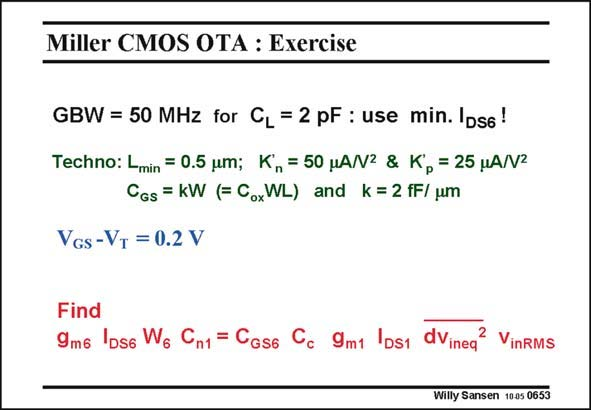

# SANSEN-0653 · Miller CMOS OTA : Exercise

章节：06 运算放大器的系统化设计  
PDF 页：205；书本页：209；幻灯片编号：0653  
状态：unreviewed



## 对应教材讲解

### PDF 204 · 书本 208

As a conclusion to this Chapter, a design exercise is launched of a Miller CMOS OTA. The specifications are fairly conventional. It is suggested to adopt the second design plan, in which the minimum current in the output stage is to be calculated first.

### PDF 205 · 书本 209

The sequence suggested to design this amplifier is given. After g and I we m6 DS6 have to extract W as this 6 provides C which is GS6 taken to be equal to C . n1 The compensation capacitance C is now easily c obtained from the expression for the non-dominant pole. Finally, we design the input stage as we know C . c Noise density and integrated noise are easy extensions in this design exercise.

## 公式／性能结论候选摘录

以下为规则截取的原文，尚未逐项判读。

- PDF 204: As a conclusion to this Chapter, a design exercise is launched of a Miller CMOS OTA.
- PDF 205: After g and I we m6 DS6 have to extract W as this 6 provides C which is GS6 taken to be equal to C . n1 The compensation capacitance C is now easily c obtained from the expression for the non-dominant pole.

## 曲线结论候选摘录

以下为规则截取的原文，尚未逐项判读。

（未由规则找到；不代表原页没有此类内容。）

## 原文条件与近似候选摘录

以下为规则截取的原文，尚未逐项判读。

（未由规则找到；不代表原页没有此类内容。）

## 幻灯片 OCR（未校正）

```text
Miller CMOS OTA : Exercise
GBW = 50 MHz for CL = 2 pF : use min. IDs6!
Techno: Lmin = 0.5 um; K, = 50 HA/N2 & Kp = 25 HA/N2
CGs = KW (F CoxWL) and k=2 fF/ um
VGs -VT = 0.2 V
Find
9m6 IDs6 Wg Cn1 = CGs6 Cc 9mt IDs1 dVinea
2 VinRMS
Willy Sansen 1005 0653
```

数学上下标、分数及正负号以原图为准。电路图已保留；未核对的连接不输出成可仿真 netlist。
