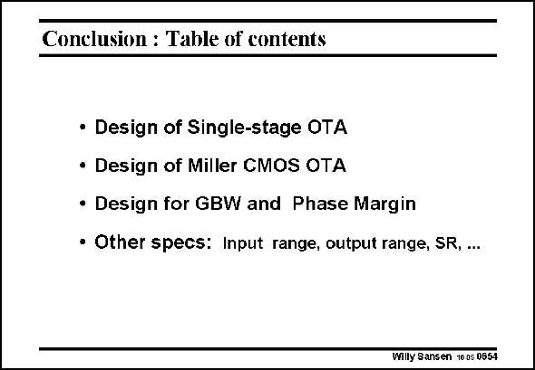

# SANSEN-0654 · Conclusion : Table of contents

章节：06 运算放大器的系统化设计  
PDF 页：205；书本页：209；幻灯片编号：0654  
状态：unreviewed



## 对应教材讲解

### PDF 205 · 书本 209

In this Chapter, a considerable amount of design detail has been given on a Miller CMOS operational transconductance amplifier. It has been shown that an optimum can be reached in terms of power consumption and that this optimum can be reached along various different design procedures. In practice, too many specifications have to be fulfilled however, for too few design variables. Many compromises are thus to be taken. Increasing the complexity of the circuit configuration is only one way to deal with these compromises. This is why we want to examine more complicated circuits and different realizations of operational amplifiers.

## 公式／性能结论候选摘录

以下为规则截取的原文，尚未逐项判读。

- PDF 205: Many compromises are thus to be taken.

## 曲线结论候选摘录

以下为规则截取的原文，尚未逐项判读。

（未由规则找到；不代表原页没有此类内容。）

## 原文条件与近似候选摘录

以下为规则截取的原文，尚未逐项判读。

（未由规则找到；不代表原页没有此类内容。）

## 幻灯片 OCR（未校正）

```text
Conclusion : Table of contents
• Design of Single-stage OTA
• Design of Miller CMOS OTA
• Design for GBW and Phase Margin
• Other specs: Input range, output range, SR, ...
Willy Sansen 1005 0654
```

数学上下标、分数及正负号以原图为准。电路图已保留；未核对的连接不输出成可仿真 netlist。
