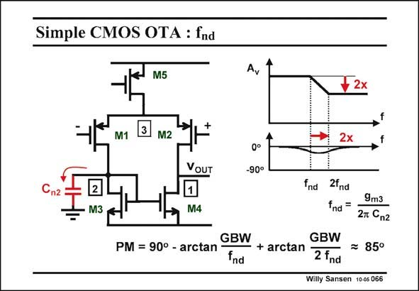

# SANSEN-066 · Simple CMOS OTA : fnd

章节：06 运算放大器的系统化设计  
PDF 页：179；书本页：183；幻灯片编号：066  
状态：unreviewed



## 对应教材讲解

### PDF 179 · 书本 183

The capacitance C on n2 node 2 does create a pole indeed, but also a zero. Indeed, a capacitance to ground on the other side of a differential amplifier with a single output, creates a pole f and a zero at twice nd the frequency 2×f . nd At higher frequencies, the output current is divided by two, since the current mirror does not receive any more current. A division by two can only be represented by a pole-zero doublet, the zero of which is a factor of two higher than the pole.

### PDF 180 · 书本 184

This is illustrated for the voltage amplifier in which all other capacitances are omitted. The advantage of this zero is that it greatly compensates the phase shift of the pole. The net result is a small change in phase shift. The influence on the Phase Margin of this pole-zero pair is therefore negligible. As a result, the capacitance C at node 2 can be ignored. We have now found two reasons n2 for that.

## 公式／性能结论候选摘录

以下为规则截取的原文，尚未逐项判读。

- PDF 180: The influence on the Phase Margin of this pole-zero pair is therefore negligible.
- PDF 180: As a result, the capacitance C at node 2 can be ignored.

## 曲线结论候选摘录

以下为规则截取的原文，尚未逐项判读。

- PDF 180: The advantage of this zero is that it greatly compensates the phase shift of the pole.
- PDF 180: The net result is a small change in phase shift.
- PDF 180: The influence on the Phase Margin of this pole-zero pair is therefore negligible.

## 原文条件与近似候选摘录

以下为规则截取的原文，尚未逐项判读。

- PDF 180: As a result, the capacitance C at node 2 can be ignored.

## 幻灯片 OCR（未校正）

```text
Simple CMOS OTA : fnd
M5
Av
M1
M2
2x
VOUT
0°
-90°
"n2
2
M3
M4
nd 2ind
9m3
fnd=
27 Cn2
GBW
GBW
PM = 90° - arctan
fnd
- + arctan 2 fnd
= 85°
Willy Sansen 10-05 066
```

数学上下标、分数及正负号以原图为准。电路图已保留；未核对的连接不输出成可仿真 netlist。
