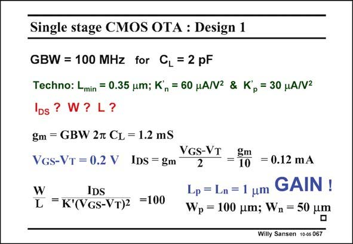

# SANSEN-067 · Single stage CMOS OTA : Design 1

章节：06 运算放大器的系统化设计  
PDF 页：180；书本页：184；幻灯片编号：067  
状态：unreviewed



## 对应教材讲解

### PDF 180 · 书本 184

As a design example, let us take a GBW and C as L indicated. The g is readily calcum lated, and so is the current, provided the V −V is GS T chosen appropriately (to be 0.2 V). By means of the K∞ factor we can calculate the required W/L. Now the L must be selected. In order to achieve some gain, we take about 3 times the minimum channel length or 1 mm. The widths are then easily added. The nMOS has a smaller width as its K∞ is larger. We could try to verify whether the pole at node 2 is indeed negligible. For this purpose we must find f or rather the input capacitance C . T GS2 A MOST has a C =kW with k=2 fF/mm if the minimum length is used. A MOST with a GS W/L=100 for a L=0.35 mm would have a W=35 mm and hence a C of 70 fF. Now both the GS L and W are three times larger. The C is 70×3×3=630 fF. Its f is about 300 MHz and GS2 T2 f /4#76 MHz. Luckily, this pole is followed by zero!!! T2 If we really do not want this pole-zero doublet below the GBW, we have to make the transistors smaller, deteriorating the gain. Another possibility is to make the transistors smaller and to add cascodes to increase the gain!

## 公式／性能结论候选摘录

以下为规则截取的原文，尚未逐项判读。

- PDF 180: In order to achieve some gain, we take about 3 times the minimum channel length or 1 mm.
- PDF 180: T2 If we really do not want this pole-zero doublet below the GBW, we have to make the transistors smaller, deteriorating the gain.
- PDF 180: Another possibility is to make the transistors smaller and to add cascodes to increase the gain!

## 曲线结论候选摘录

以下为规则截取的原文，尚未逐项判读。

（未由规则找到；不代表原页没有此类内容。）

## 原文条件与近似候选摘录

以下为规则截取的原文，尚未逐项判读。

- PDF 180: The g is readily calcum lated, and so is the current, provided the V −V is GS T chosen appropriately (to be 0.2 V).

## 幻灯片 OCR（未校正）

```text
Single stage CMOS OTA : Design 1
GBW = 100 MHz for C, = 2 pF
Techno: Lmin = 0.35 um; K,= 60 HA/V2 & K, = 30 HA/V2
IDs ? W?
L?
gm = GBW 2m CL = 1.2 mS
VGs-VT = 0.2 V IDS = gm
W
IDS
L =K'(VGs-VT)2 =100
VGS-VT
2
gm
10
= 0.12 mA
Lp = Ln = 1 um
GAIN !
Wp = 100 pm; Wn = 50 um
Willy Sansen 10-0s 067
```

数学上下标、分数及正负号以原图为准。电路图已保留；未核对的连接不输出成可仿真 netlist。
