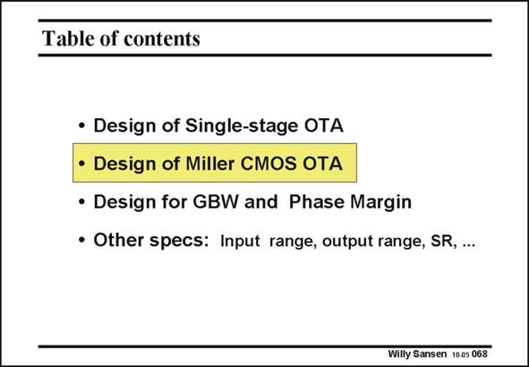

# SANSEN-068 · Table of contents

章节：06 运算放大器的系统化设计  
PDF 页：181；书本页：185；幻灯片编号：068  
状态：unreviewed



## 对应教材讲解

### PDF 181 · 书本 185

Now we focus on the design plan of a CMOS Miller OTA, realized with transistors. Again we will verify the gain, bandwidth and the GBW. Moreover, we have to make sure that the compensation capacitance generates enough polesplitting to position the f beyond nd the GBW.

## 公式／性能结论候选摘录

以下为规则截取的原文，尚未逐项判读。

- PDF 181: Again we will verify the gain, bandwidth and the GBW.

## 曲线结论候选摘录

以下为规则截取的原文，尚未逐项判读。

（未由规则找到；不代表原页没有此类内容。）

## 原文条件与近似候选摘录

以下为规则截取的原文，尚未逐项判读。

（未由规则找到；不代表原页没有此类内容。）

## 幻灯片 OCR（未校正）

```text
Table of contents
• Design of Single-stage OTA
• Design of Miller CMOS OTA
• Design for GBW and Phase Margin
• Other specs: Input range, output range, SR, ...
Willy Sansen 1005 068
```

数学上下标、分数及正负号以原图为准。电路图已保留；未核对的连接不输出成可仿真 netlist。
