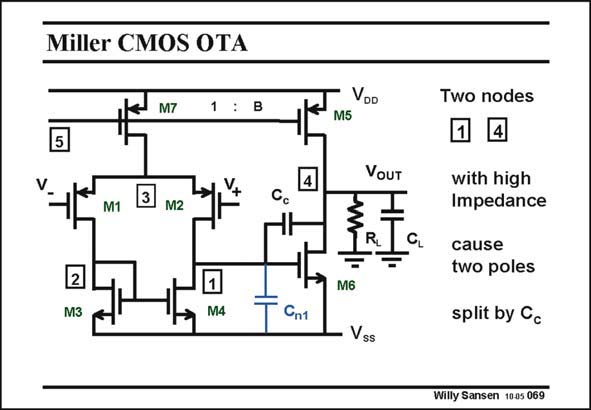

# SANSEN-069 · Miller CMOS OTA

章节：06 运算放大器的系统化设计  
PDF 页：181；书本页：185；幻灯片编号：069  
状态：unreviewed



## 对应教材讲解

### PDF 181 · 书本 185

A CMOS OTA is shown in this slide. The input devices are normally pMOST devices as they give better matching (see Chapter 12). The first block converts the differential input voltage into a current by means of transconductance g . m1 The second stage is a transimpedance amplifier, converting this current into a voltage. Actually, only one transistor M6 takes care of that, together with capacitance C . c Obviously this circuit is the most straightforward realization of the two-stage OTA discussed in the previous Chapter. Indeed, nodes 1 and 4 cause two poles, which are split by C . Parasitic capacitance C is also c n1 shown. It consists mainly of the input capacitance C of transistor M6. This latter transistor GS6 is a big transistor as it carries a much larger current than the input transistors.

## 公式／性能结论候选摘录

以下为规则截取的原文，尚未逐项判读。

（未由规则找到；不代表原页没有此类内容。）

## 曲线结论候选摘录

以下为规则截取的原文，尚未逐项判读。

（未由规则找到；不代表原页没有此类内容。）

## 原文条件与近似候选摘录

以下为规则截取的原文，尚未逐项判读。

- PDF 181: This latter transistor GS6 is a big transistor as it carries a much larger current than the input transistors.

## 幻灯片 OCR（未校正）

```text
Miller CMOS OTA
M7
1 : B
5
4
M1
M2
2
M3
M4
Cnt
VDD
M5
Two nodes
VOUT
CL
M6
- Vss
with high
Impedance
cause
two poles
split by Cc
Willy Sansen 1005 069
```

数学上下标、分数及正负号以原图为准。电路图已保留；未核对的连接不输出成可仿真 netlist。
