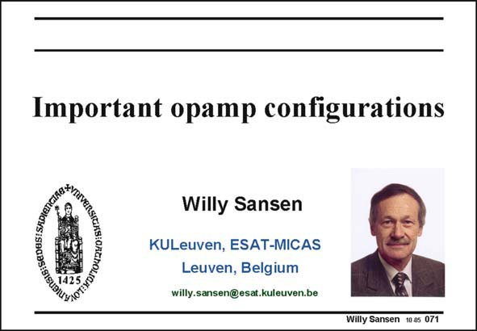

# SANSEN-071 · Slide 071

章节：07 常用运算放大器电路  
PDF 页：206；书本页：211；幻灯片编号：071  
状态：unreviewed



## 对应教材讲解

### PDF 206 · 书本 211

The list of different operational amplifiers is endless. And yet it is possible to classify them in a limited number of important categories. Examples are symmetrical opamps and folded cascodes. They are being reused and redesigned continuously. They are the kings of the list of important amplifiers. Many other opamps can be included in this list because they highlight some cleverness in design or because they excel in performance. In this Chapter, a review is given on many important opamp circuits. In many cases the design compromises are discussed, together with their limits in terms of speed or noise or some other specifications.

## 公式／性能结论候选摘录

以下为规则截取的原文，尚未逐项判读。

- PDF 206: And yet it is possible to classify them in a limited number of important categories.
- PDF 206: In many cases the design compromises are discussed, together with their limits in terms of speed or noise or some other specifications.

## 曲线结论候选摘录

以下为规则截取的原文，尚未逐项判读。

（未由规则找到；不代表原页没有此类内容。）

## 原文条件与近似候选摘录

以下为规则截取的原文，尚未逐项判读。

（未由规则找到；不代表原页没有此类内容。）

## 幻灯片 OCR（未校正）

```text
Important opamp configurations
GIG: SEDESI SRDIanG
Аареотоикао и ие
Willy Sansen
KULeuven, ESAT-MICAS
Leuven, Belgium
willy.sansen@esat.kuleuven.be
Willy Sansen 10.05 071
```

数学上下标、分数及正负号以原图为准。电路图已保留；未核对的连接不输出成可仿真 netlist。
