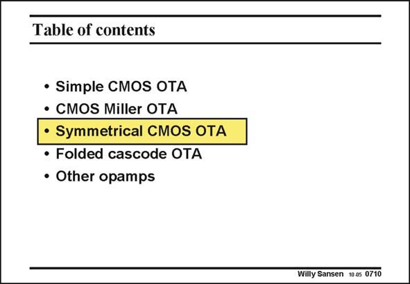

# SANSEN-0710 · Table of contents

章节：07 常用运算放大器电路  
PDF 页：210；书本页：215；幻灯片编号：0710  
状态：unreviewed



## 对应教材讲解

### PDF 210 · 书本 215

One of the most used OTA’s is the symmetrical OTA. It is more symmetrical than the Miller OTA. As a result, matching is improved which provides better offset and CMRR specifications (see Chapter 15).

## 公式／性能结论候选摘录

以下为规则截取的原文，尚未逐项判读。

- PDF 210: As a result, matching is improved which provides better offset and CMRR specifications (see Chapter 15).

## 曲线结论候选摘录

以下为规则截取的原文，尚未逐项判读。

（未由规则找到；不代表原页没有此类内容。）

## 原文条件与近似候选摘录

以下为规则截取的原文，尚未逐项判读。

（未由规则找到；不代表原页没有此类内容。）

## 幻灯片 OCR（未校正）

```text
Table of contents
• Simple CMOS OTA
• CMOS Miller OTA
• Symmetrical CMOS OTA
• Folded cascode OTA
• Other opamps
Willy Sansen 100s 0710
```

数学上下标、分数及正负号以原图为准。电路图已保留；未核对的连接不输出成可仿真 netlist。
