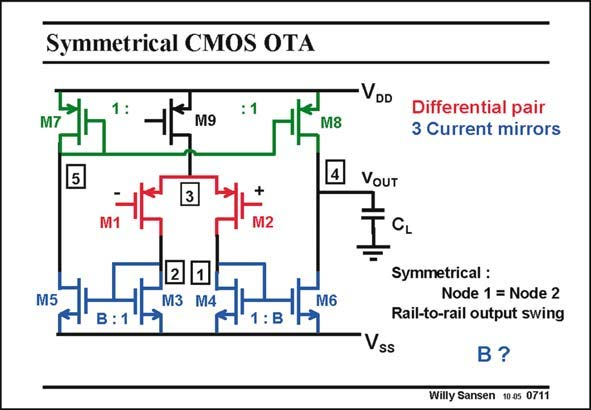

# SANSEN-0711 · Symmetrical CMOS OTA

章节：07 常用运算放大器电路  
PDF 页：211；书本页：216；幻灯片编号：0711  
状态：unreviewed



## 对应教材讲解

### PDF 210 · 书本 215

A symmetrical OTA consists of one differential pair and three current mirrors. The input differential pair is loaded with two equal current mirrors, which provide a current gain B. It is sometimes called a load-compensated OTA as both loads are now the same. In the case of a single-ended output we need another current mirror with gain 1 to reach this

### PDF 211 · 书本 216

output. In the case of two outputs (in the next Chapter), we do not need this current mirror any more. This analysis is carried out for a single-ended output. It is clear that this OTA is symmetrical. The input devices see exactly the same DC voltage and load impedance. This is about the best that can be achieved with respect to matching. Moreover, there is some extra gain, by current factor B. How far can we go with B?

## 公式／性能结论候选摘录

以下为规则截取的原文，尚未逐项判读。

- PDF 210: The input differential pair is loaded with two equal current mirrors, which provide a current gain B.
- PDF 210: In the case of a single-ended output we need another current mirror with gain 1 to reach this
- PDF 211: Moreover, there is some extra gain, by current factor B.

## 曲线结论候选摘录

以下为规则截取的原文，尚未逐项判读。

（未由规则找到；不代表原页没有此类内容。）

## 原文条件与近似候选摘录

以下为规则截取的原文，尚未逐项判读。

（未由规则找到；不代表原页没有此类内容。）

## 幻灯片 OCR（未校正）

```text
Symmetrical CMOS OTA
M9
M8
3
2
M3
1
M4
M6
: B
•VDD
Differential pair
3 Current mirrors
VOUT
CL
Symmetrical :
Node 1 = Node 2
Rail-to-rail output swing
Vss
B?
Willy Sansen 10.05 0711
```

数学上下标、分数及正负号以原图为准。电路图已保留；未核对的连接不输出成可仿真 netlist。
