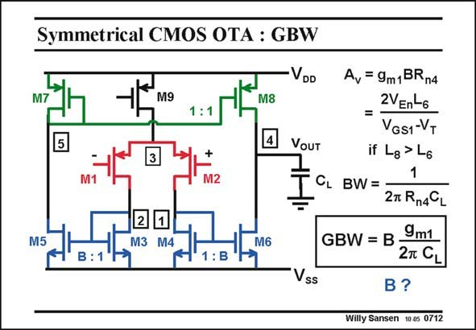

# SANSEN-0712 · Symmetrical CMOS OTA : GBW

章节：07 常用运算放大器电路  
PDF 页：211；书本页：216；幻灯片编号：0712  
状态：unreviewed



## 对应教材讲解

### PDF 211 · 书本 216

The gain at low frequencies is easily calculated. Indeed, the circular current, generated by the input devices, is amplified by B and flows in the output load. The output resistance R n4 at node 4 is quite high. Actually it is the only high resistance in the circuit. All other nodes are at the 1/g m level. As a result, this is a single-stage amplifier: there is only one high-resistance node, one single node where the gain is large, where the swing is large, and ultimately where the dominant pole is formed. The voltage gain at low frequencies is now easily obtained. The bandwidth is created at the same output node. The GBW is the product. It is the same as for a single-transistor amplifier but multiplied by current factor B. Increasing B increases the GBW. How far can we go with B?

## 公式／性能结论候选摘录

以下为规则截取的原文，尚未逐项判读。

- PDF 211: The gain at low frequencies is easily calculated.
- PDF 211: As a result, this is a single-stage amplifier: there is only one high-resistance node, one single node where the gain is large, where the swing is large, and ultimately where the dominant pole is formed.
- PDF 211: The voltage gain at low frequencies is now easily obtained.
- PDF 211: The bandwidth is created at the same output node.
- PDF 211: Increasing B increases the GBW.

## 曲线结论候选摘录

以下为规则截取的原文，尚未逐项判读。

（未由规则找到；不代表原页没有此类内容。）

## 原文条件与近似候选摘录

以下为规则截取的原文，尚未逐项判读。

（未由规则找到；不代表原页没有此类内容。）

## 幻灯片 OCR（未校正）

```text
Symmetrical CMOS OTA : GBW
VDD
M9
M8
VOUT
M5
2
1
M3 M4
M6
: B
SS
Av = 9m1 BRn4
2VEn-6
=
VGS1-VT
if Lg > L6
1
CL BW=.
2T R14CL
GBW = B
9m1
2л С
В?
Willy Sansen 10.05 0712
```

数学上下标、分数及正负号以原图为准。电路图已保留；未核对的连接不输出成可仿真 netlist。
