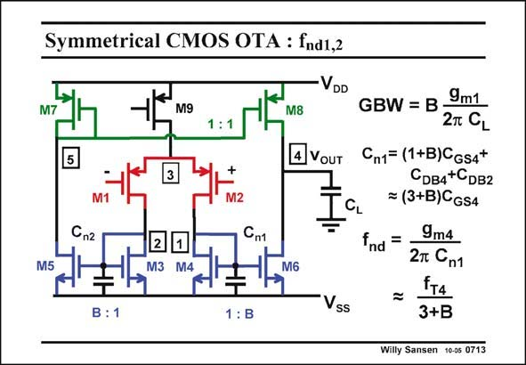

# SANSEN-0713 · Symmetrical CMOS OTA : fnd1,2

章节：07 常用运算放大器电路  
PDF 页：212；书本页：217；幻灯片编号：0713  
状态：unreviewed



## 对应教材讲解

### PDF 211 · 书本 216

However, all other nodes create non-dominant poles. Since we find three other nodes 1, 2 and 5, do we have three non-dominant poles?

### PDF 212 · 书本 217

The answer is negative. We will see that only one non-dominant pole is playing a role. It is the one at nodes 1 and 2. How can the non-dominant pole at node 1 be the same as at node 2? Actually, for a differential output voltage, it is fairly easy to show that these nodes together form just one pole (see next slide). As a result, the non-dominant pole is determined by the resistance 1/g and all m4 capacitances connected to that node. They are listed in this slide. As a very crude approximation, we take them all to be the same, except for the current mirror. At node 1, transistor M6 offers an input capacitance which is B times larger than for transistor M4. Finally, the non-dominant pole frequency can be rewritten in terms of f and current factor T B. The larger B, the lower the non-dominant pole. This expression therefore provides the limit on B.

## 公式／性能结论候选摘录

以下为规则截取的原文，尚未逐项判读。

- PDF 212: As a result, the non-dominant pole is determined by the resistance 1/g and all m4 capacitances connected to that node.
- PDF 212: This expression therefore provides the limit on B.

## 曲线结论候选摘录

以下为规则截取的原文，尚未逐项判读。

（未由规则找到；不代表原页没有此类内容。）

## 原文条件与近似候选摘录

以下为规则截取的原文，尚未逐项判读。

- PDF 212: As a very crude approximation, we take them all to be the same, except for the current mirror.

## 幻灯片 OCR（未校正）

```text
Symmetrical CMOS OTA : fnd1,2
VDD
M9
M8
A VOUT
3
+
M2
Cn2
M5
1
M3 M4
Сп1
B : 1
1 : B
Vss
GBW = B -
9m1
2T CL
Cn1= (1+B)CGs4*
Cрв4+CDв2
= (3+B)CGs4
nd
=
9m4
2T Cn1
=
FTA
3+B
Willy Sansen 10-0s 0713
```

数学上下标、分数及正负号以原图为准。电路图已保留；未核对的连接不输出成可仿真 netlist。
