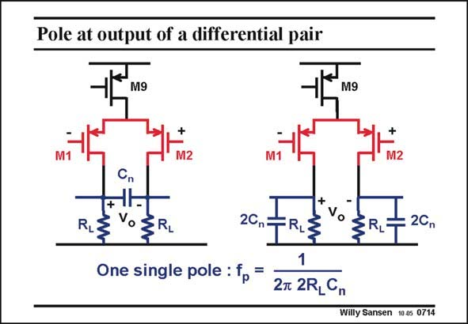

# SANSEN-0714 · Pole at output of a differential pair

章节：07 常用运算放大器电路  
PDF 页：212；书本页：217；幻灯片编号：0714  
状态：unreviewed



## 对应教材讲解

### PDF 212 · 书本 217

For a differential output, two transistors to ground provide only a first-order characteristic – there is only one single pole. This is obvious for the circuit on the left. Since there is only one capacitance, only one pole can emerge. However, this circuit can easily be converted to the circuit on the right. We take two capacitances in series with double the value and then ground the node between both capacitances. This is how the circuit on the right is derived from the first one. For AC they are exactly the same. They have the same pole! To make it slightly more intriguing, we could wonder what happens if there is some asymmetry. For example, if one capacitance is slightly larger than the other one, how can it create a pole with the same value? In this case, we find two poles, but we also find a zero inbetween, to ensure a first-order roll-off.

### PDF 213 · 书本 218

The net result is that for a differential output, these two nodes establish one single pole only!

## 公式／性能结论候选摘录

以下为规则截取的原文，尚未逐项判读。

（未由规则找到；不代表原页没有此类内容。）

## 曲线结论候选摘录

以下为规则截取的原文，尚未逐项判读。

- PDF 212: For a differential output, two transistors to ground provide only a first-order characteristic – there is only one single pole.
- PDF 212: In this case, we find two poles, but we also find a zero inbetween, to ensure a first-order roll-off.

## 原文条件与近似候选摘录

以下为规则截取的原文，尚未逐项判读。

（未由规则找到；不代表原页没有此类内容。）

## 幻灯片 OCR（未校正）

```text
Pole at output of a differential pair
M9
M9
REVOER
One single pole : fp =
2Cn=
TRIS
1
2t 2R,Cn
: 2Cn
Willy Sansen 10.05 0714
```

数学上下标、分数及正负号以原图为准。电路图已保留；未核对的连接不输出成可仿真 netlist。
