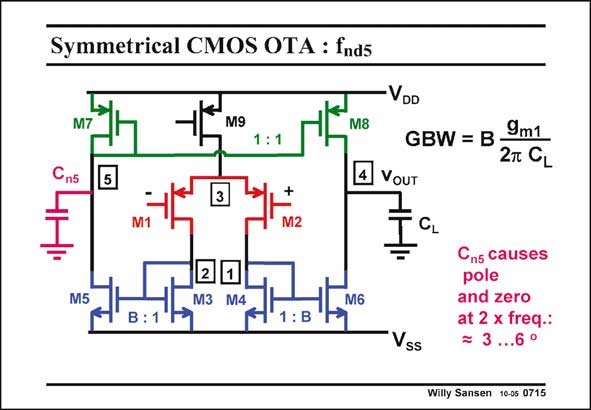

# SANSEN-0715 · Symmetrical CMOS OTA : fnds

章节：07 常用运算放大器电路  
PDF 页：213；书本页：218；幻灯片编号：0715  
状态：unreviewed



## 对应教材讲解

### PDF 213 · 书本 218

How about the pole at node 5? Remember that this is a node at the other side of a single-ended amplifier. Each time we have a single-ended amplifier, the capacitances on the other side than the output, will be negligible for the Phase Margin. Indeed, a pole-zero doublet is created by the capacitances at this node 5. Its spreading is only 2. As a result, the effect on the Phase Margin is now negligible. Despite the fact that we have three nodes at the 1/g level, we only have one single nonm dominant pole!

## 公式／性能结论候选摘录

以下为规则截取的原文，尚未逐项判读。

- PDF 213: As a result, the effect on the Phase Margin is now negligible.

## 曲线结论候选摘录

以下为规则截取的原文，尚未逐项判读。

- PDF 213: Each time we have a single-ended amplifier, the capacitances on the other side than the output, will be negligible for the Phase Margin.
- PDF 213: As a result, the effect on the Phase Margin is now negligible.

## 原文条件与近似候选摘录

以下为规则截取的原文，尚未逐项判读。

（未由规则找到；不代表原页没有此类内容。）

## 幻灯片 OCR（未校正）

```text
Symmetrical CMOS OTA : fnds
M9
VDD
M8
4 VOUT
GBW = B•
9m1
2T CL
2
M5
M6
B
SS
Cns causes
pole
and zero
at 2 x freq.:
= 3 ...6°
Willy Sansen 10-0s 0715
```

数学上下标、分数及正负号以原图为准。电路图已保留；未核对的连接不输出成可仿真 netlist。
