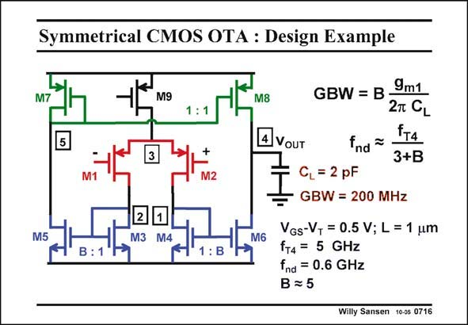

# SANSEN-0716 · Symmetrical CMOS OTA : Design Example

章节：07 常用运算放大器电路  
PDF 页：213；书本页：218；幻灯片编号：0716  
状态：unreviewed



## 对应教材讲解

### PDF 213 · 书本 218

As an example, let us design a CMOS symmetrical OTA for a GBW of 200 MHz and 2 pF load capacitance. The expressions of the GBW and f are repeated. nd Obviously, for wide-band performance, we have to take a high-speed transistor for M4 and M6. This means that this current amplifier (or mirror) devices have to be designed for large V −V and small L. GS T Some values have been selected, depending on the CMOS process available. The resulting f is about 5 GHz. T The maximum value of B is found by equating f to 3×GBW. The value of B is therefore 5. nd Many designers use between 3 and 5. The input transconductance is now easily obtained from the GBW. It is g =0.5 mS, which m1 requires about 50 mA. The total current consumption is now 0.6 mA. The FOM of this amplifier is 670 MHzpF/mA, which is quite good, indeed!

## 公式／性能结论候选摘录

以下为规则截取的原文，尚未逐项判读。

- PDF 213: GS T Some values have been selected, depending on the CMOS process available.
- PDF 213: The value of B is therefore 5. nd Many designers use between 3 and 5.

## 曲线结论候选摘录

以下为规则截取的原文，尚未逐项判读。

（未由规则找到；不代表原页没有此类内容。）

## 原文条件与近似候选摘录

以下为规则截取的原文，尚未逐项判读。

（未由规则找到；不代表原页没有此类内容。）

## 幻灯片 OCR（未校正）

```text
Symmetrical CMOS OTA : Design Example
M9
+
M2
M5
2
1
M3
M4
M8
4 VOUT
GBW = B•
9m1
2T CL
tт4
fnd ~
3+B
CL = 2 pF
GBW = 200 MHz
M6
VGs-VT = 0.5 V; L = 1 um
fT4 = 5 GHz
fnd = 0.6 GHz
B = 5
Willy Sansen 10-05 0716
```

数学上下标、分数及正负号以原图为准。电路图已保留；未核对的连接不输出成可仿真 netlist。
