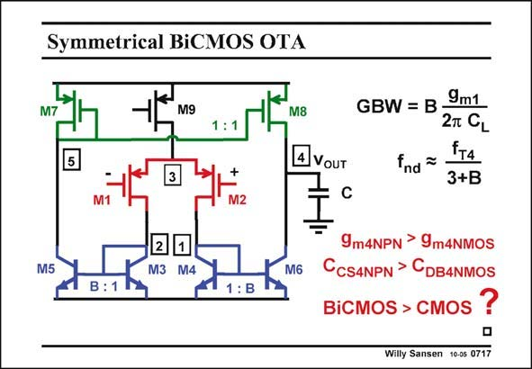

# SANSEN-0717 · Symmetrical BiCMOS OTA

章节：07 常用运算放大器电路  
PDF 页：214；书本页：219；幻灯片编号：0717  
状态：unreviewed



## 对应教材讲解

### PDF 214 · 书本 219

Can BiCMOS provide similar power savings as for a Miller OTA? The answer is negative. The current sources are the only candidates to be implemented in bipolar. The input devices are better MOSTs. They provide less input biasing current and higher Slew Rate. There are two considerations: 1. The npn transistors certainly have a higher g m but this advantage is not really exploited in a current mirror. They also have a higher f , at least within a particular T BiCMOS process. They may not have a higher f however, than the nMOSTs in a more T advanced standard CMOS process, offered at the same time. 2. Bipolar transistors have a relatively large collector-substrate capacitance C . As a result, the CS parasitic capacitance at nodes 1 and 2 are probably a lot larger than those given by f . T As a conclusion, a BiCMOS symmetrical OTA is probably not faster than a CMOS equivalent. For the same GBW it probably does not draw less current than the CMOS.

## 公式／性能结论候选摘录

以下为规则截取的原文，尚未逐项判读。

- PDF 214: As a result, the CS parasitic capacitance at nodes 1 and 2 are probably a lot larger than those given by f .
- PDF 214: T As a conclusion, a BiCMOS symmetrical OTA is probably not faster than a CMOS equivalent.

## 曲线结论候选摘录

以下为规则截取的原文，尚未逐项判读。

（未由规则找到；不代表原页没有此类内容。）

## 原文条件与近似候选摘录

以下为规则截取的原文，尚未逐项判读。

（未由规则找到；不代表原页没有此类内容。）

## 幻灯片 OCR（未校正）

```text
Symmetrical BiCMOS OTA
M9
M8
4 VOUT
GBW = B -
9m1
2T CL
FT4
fnd ~
3+B
M2
M5
2
1
M3 M4
M6
9m4NPN > 9m4NMOS
CCSANPN > CDBANMOS
BiCMOS > CMOS
?
Willy Sansen 10-05 0717
```

数学上下标、分数及正负号以原图为准。电路图已保留；未核对的连接不输出成可仿真 netlist。
