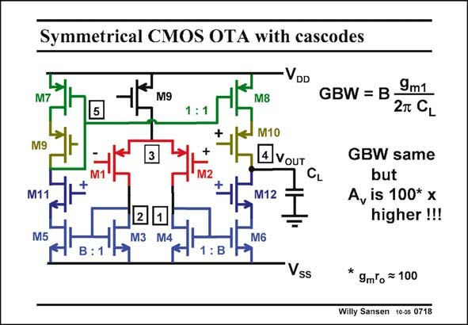

# SANSEN-0718 · Symmetrical CMOS OTA with cascodes

章节：07 常用运算放大器电路  
PDF 页：214；书本页：219；幻灯片编号：0718  
状态：unreviewed



## 对应教材讲解

### PDF 214 · 书本 219

The previous symmetrical OTA’s all had too little gain. Cascodes are now added to increase the gain. Gain boosting could even be applied to the output cascodes M10 and M12 to boost the gain even more. Note that cascodes are added on both sides, to preserve symmetry. Also note that a current mirror is taken (with M7–M10) which allows a large output swing. Indeed the output voltage can swing to within 0.4 V of the supply voltage, without transistors M8/M10 or M6/M12 entering the linear region. The insertion of cascodes increases the gain but not the GBW. The cascodes only increase the gain at low frequencies, as previously shown. Moreover, the gain at low frequencies can be increased even more by application of gain boosting to the cascodes M10 and M12. This is a

### PDF 215 · 书本 220

general practice for nanometer CMOS where the gain per transistor has become quite small, i.e. less than 10.

## 公式／性能结论候选摘录

以下为规则截取的原文，尚未逐项判读。

- PDF 214: The previous symmetrical OTA’s all had too little gain.
- PDF 214: Cascodes are now added to increase the gain.
- PDF 214: Gain boosting could even be applied to the output cascodes M10 and M12 to boost the gain even more.
- PDF 214: The insertion of cascodes increases the gain but not the GBW.
- PDF 214: The cascodes only increase the gain at low frequencies, as previously shown.
- PDF 214: Moreover, the gain at low frequencies can be increased even more by application of gain boosting to the cascodes M10 and M12.
- PDF 215: general practice for nanometer CMOS where the gain per transistor has become quite small, i.e. less than 10.

## 曲线结论候选摘录

以下为规则截取的原文，尚未逐项判读。

（未由规则找到；不代表原页没有此类内容。）

## 原文条件与近似候选摘录

以下为规则截取的原文，尚未逐项判读。

（未由规则找到；不代表原页没有此类内容。）

## 幻灯片 OCR（未校正）

```text
Symmetrical CMOS OTA with cascodes
VDD
M9
M2
M11
M8
M10
4 VOUT
M12
GBW = B -
9m1
2T CL
GBW same
but
A, is 100* x
higher !!!
M5
2
1
M3
M4
M6
: B
Vss
*
9m o = 100
Willy Sansen 10-05 0718
```

数学上下标、分数及正负号以原图为准。电路图已保留；未核对的连接不输出成可仿真 netlist。
