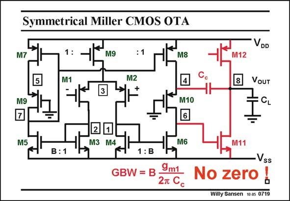

# SANSEN-0719 · Symmetrical Miller CMOS OTA

章节：07 常用运算放大器电路  
PDF 页：215；书本页：220；幻灯片编号：0719  
状态：unreviewed



## 对应教材讲解

### PDF 215 · 书本 220

A two-stage Miller operational amplifier is easily built by means of a symmetrical OTA as a first stage, as shown in this slide. Its GBW also includes C c and B. The compensation capacitance C is obviously not c connected directly from Drain to Gate, but takes a path through cascode transistor M10 to avoid the positive zero. As a result, the current through the output stage M11/M12 can be taken smaller, saving power.

## 公式／性能结论候选摘录

以下为规则截取的原文，尚未逐项判读。

- PDF 215: As a result, the current through the output stage M11/M12 can be taken smaller, saving power.

## 曲线结论候选摘录

以下为规则截取的原文，尚未逐项判读。

（未由规则找到；不代表原页没有此类内容。）

## 原文条件与近似候选摘录

以下为规则截取的原文，尚未逐项判读。

（未由规则找到；不代表原页没有此类内容。）

## 幻灯片 OCR（未校正）

```text
Symmetrical Miller CMOS OTA
VDD
M7
1:
M9
5
M1
M2
M9
M8
4
M10
M12
8
VOUT
M5
2
M3 M4
M6
1 : B
GBW = B :
9m1
2n Cc
Vss
No zero
Willy Sansen 10-05 0719
```

数学上下标、分数及正负号以原图为准。电路图已保留；未核对的连接不输出成可仿真 netlist。
