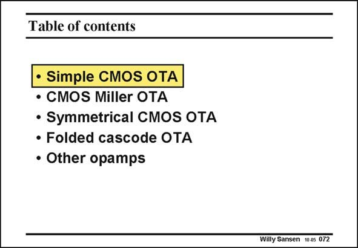

# SANSEN-072 · Table of contents

章节：07 常用运算放大器电路  
PDF 页：206；书本页：211；幻灯片编号：072  
状态：unreviewed



## 对应教材讲解

### PDF 206 · 书本 211

In this Chapter the trade offs between standard CMOS and BiCMOS are also discussed. This is why some known schematics are also included. Most of the discussion is on the symmetrical OTA and the folded cascode OTA as they are so often used. Finally, a list of published opamps are discussed to show that the design principles are applicable to most of them. We recall the simplest differential voltage amplifier that we have observed.

## 公式／性能结论候选摘录

以下为规则截取的原文，尚未逐项判读。

（未由规则找到；不代表原页没有此类内容。）

## 曲线结论候选摘录

以下为规则截取的原文，尚未逐项判读。

（未由规则找到；不代表原页没有此类内容。）

## 原文条件与近似候选摘录

以下为规则截取的原文，尚未逐项判读。

（未由规则找到；不代表原页没有此类内容。）

## 幻灯片 OCR（未校正）

```text
Table of contents
• Simple CMOS OTA
• CMOS Miller OTA
• Symmetrical CMOS OTA
• Folded cascode OTA
• Other opamps
Willy Sansen 10.05 072
```

数学上下标、分数及正负号以原图为准。电路图已保留；未核对的连接不输出成可仿真 netlist。
