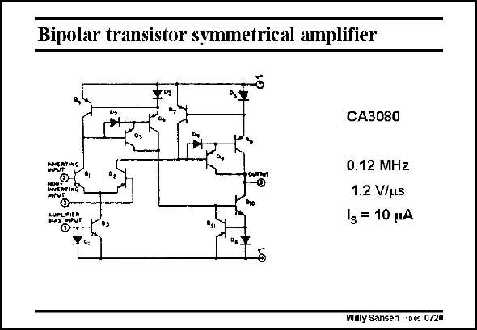

# SANSEN-0720 · Bipolar transistor symmetrical amplifier

章节：07 常用运算放大器电路  
PDF 页：215；书本页：220；幻灯片编号：0720  
状态：unreviewed



## 对应教材讲解

### PDF 215 · 书本 220

An earlier realization of such a symmetrical OTA is shown in this slide. It is a bipolar realization. The current mirrors are quite elaborate, to obtain precise current mirroring and good matching. The specifications obviously depend on the actual DC currents flowing. Actually, this circuit block can be tuned to any value of GBW by modifying the current through Q3. The nondominant pole tracks the GBW.

## 公式／性能结论候选摘录

以下为规则截取的原文，尚未逐项判读。

- PDF 215: The specifications obviously depend on the actual DC currents flowing.

## 曲线结论候选摘录

以下为规则截取的原文，尚未逐项判读。

（未由规则找到；不代表原页没有此类内容。）

## 原文条件与近似候选摘录

以下为规则截取的原文，尚未逐项判读。

（未由规则找到；不代表原页没有此类内容。）

## 幻灯片 OCR（未校正）

```text
Bipolar transistor symmetrical amplifier
*
CA3080
HEEATNS
sumenE
0.12 MHz
1.2 V/uS
l3 = 10 MA
Willy Sansen 10€s 0720
```

数学上下标、分数及正负号以原图为准。电路图已保留；未核对的连接不输出成可仿真 netlist。
