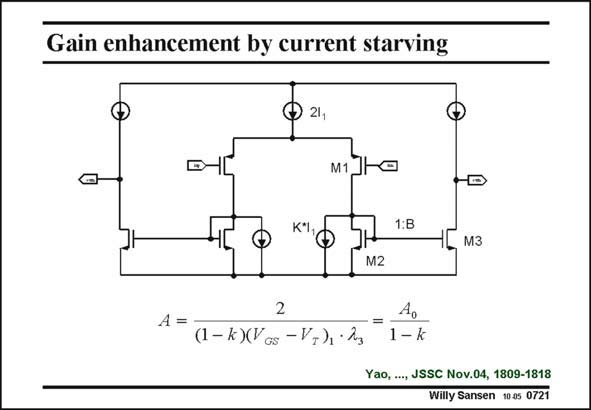

# SANSEN-0721 · Gain enhancement by current starving

章节：07 常用运算放大器电路  
PDF 页：216；书本页：221；幻灯片编号：0721  
状态：unreviewed



## 对应教材讲解

### PDF 215 · 书本 220

Another way to increase the gain is by current starving. This is actually a fully-differential symmetrical OTA. As no cascodes are used, the voltage gain is very modest.

### PDF 216 · 书本 221

However, the addition of two DC current sources with values KI increases 1 the gain considerably. A typical value for k is 0.8. In this case, 80% of the DC current provided by the input transistors M1 is taken away by the DC current sources. Only 20% of the DC current, together with the signal current is injected into the transistors M2 of the current mirrors. Because the DC currents in the output transistors M3 are also lower, the output resistances are higher and so is the voltage gain. This technique cannot be pushed too far as mismatch will occur. Moreover, the resistance at the inner node of the current mirrors determines the non-dominant pole. It cannot be increased too much.

## 公式／性能结论候选摘录

以下为规则截取的原文，尚未逐项判读。

- PDF 215: Another way to increase the gain is by current starving.
- PDF 215: As no cascodes are used, the voltage gain is very modest.
- PDF 216: However, the addition of two DC current sources with values KI increases 1 the gain considerably.
- PDF 216: Because the DC currents in the output transistors M3 are also lower, the output resistances are higher and so is the voltage gain.
- PDF 216: It cannot be increased too much.

## 曲线结论候选摘录

以下为规则截取的原文，尚未逐项判读。

（未由规则找到；不代表原页没有此类内容。）

## 原文条件与近似候选摘录

以下为规则截取的原文，尚未逐项判读。

- PDF 216: In this case, 80% of the DC current provided by the input transistors M1 is taken away by the DC current sources.

## 幻灯片 OCR（未校正）

```text
Gain enhancement by current starving
21,
D-
M1
1:B
M2
2
A =
(1- k)(Vos - V+), • 2g
4o
1- k
Yao, ..., JSSC Nov.04, 1809-1818
Willy Sansen 1005 0721
```

数学上下标、分数及正负号以原图为准。电路图已保留；未核对的连接不输出成可仿真 netlist。
